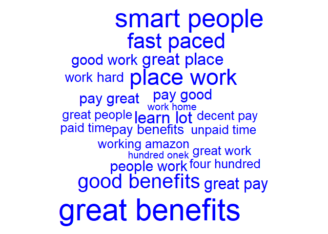
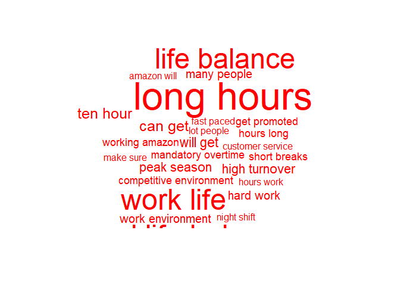

GetHired by Google
================
Jae Wilson
2017-11-02

``` r
#install.packages("ggdendro")

library(qdap)
```

    ## Loading required package: qdapDictionaries

    ## Loading required package: qdapRegex

    ## Loading required package: qdapTools

    ## Loading required package: RColorBrewer

    ## 
    ## Attaching package: 'qdap'

    ## The following object is masked from 'package:base':
    ## 
    ##     Filter

``` r
library(magrittr)
```

    ## 
    ## Attaching package: 'magrittr'

    ## The following object is masked from 'package:qdap':
    ## 
    ##     %>%

``` r
library(RWeka)
library(tm)
```

    ## Loading required package: NLP

    ## 
    ## Attaching package: 'NLP'

    ## The following object is masked from 'package:qdap':
    ## 
    ##     ngrams

    ## 
    ## Attaching package: 'tm'

    ## The following objects are masked from 'package:qdap':
    ## 
    ##     as.DocumentTermMatrix, as.TermDocumentMatrix

``` r
library(wordcloud)
library(ggdendro)
library(ggplot2)
```

    ## 
    ## Attaching package: 'ggplot2'

    ## The following object is masked from 'package:NLP':
    ## 
    ##     annotate

    ## The following object is masked from 'package:qdapRegex':
    ## 
    ##     %+%

``` r
library(tm)
library("plotrix") #for pyramidcoud
```

``` r
amzn_df <- read.csv("https://raw.githubusercontent.com/jaewilson07/Hello-World/master/Datasets/DataCamp/amzn.txt", stringsAsFactors =  FALSE)
goog_df <- read.csv("https://raw.githubusercontent.com/jaewilson07/Hello-World/master/Datasets/DataCamp/goog.txt", stringsAsFactors =  FALSE)
```

``` r
qdap_clean <- function(x) {
  x <- x %>%
    replace_abbreviation() %>%
    replace_contraction() %>%
    replace_number() %>%
    replace_ordinal() %>%
    replace_symbol() %>%
    tolower()
  return(x)
}

stpwords <- c(stopwords("en"), "Google", "Amazon", "company")

tm_clean <- function(corpus) {
  corpus <- corpus %>%
    tm_map(removePunctuation) %>%
    tm_map(stripWhitespace) %>%
    tm_map(removeWords, stpwords)
  return(corpus)
}

tokenizer <- function(x) {
  NGramTokenizer(x, Weka_control(min = 2, max = 2))
}
```

``` r
# Create amzn_pros
amzn_pro <- amzn_df$pros %>%
  na.omit() %>%
  qdap_clean()

amzn_pro_corp <- VCorpus(VectorSource(amzn_pro)) %>%
  na.omit() %>%
  tm_clean()

# Create amzn_cons
amzn_con <- amzn_df$cons %>%
  na.omit() %>%
  qdap_clean()

amzn_con_corp <- VCorpus(VectorSource(amzn_con)) %>%
  na.omit() %>%
  tm_clean()

# Create goog_pros
goog_pro <- goog_df$pros %>%
  qdap_clean()

goog_pro_amzn <- VCorpus(VectorSource(goog_pro)) %>%
  tm_clean()

# Create goog_cons
goog_con <- goog_df$cons %>%
  qdap_clean()

goog_con_corp <- VCorpus(VectorSource(goog_con)) %>%
  tm_clean()
```

``` r
# Create amzn_p_tdm
amzn_pro_tdm <- TermDocumentMatrix(amzn_pro_corp, control = list(tokenize = tokenizer))
amzn_con_tdm <- TermDocumentMatrix(amzn_con_corp, control = list(tokenize = tokenizer))

# Create amzn_p_tdm_m
amzn_pro_tdm_m <- as.matrix(amzn_pro_tdm)
amzn_con_tdm_m <- as.matrix(amzn_con_tdm)

# Create amzn_p_freq
amzn_pro_freq <- rowSums(amzn_pro_tdm_m)
amzn_con_freq <- rowSums(amzn_con_tdm_m)

# Plot a wordcloud using amzn_p_freq values
wordcloud(
  freq = amzn_pro_freq
  , words = names(amzn_pro_freq)
  , max.words= 25
  , color = "blue")
```

    ## Warning in wordcloud(freq = amzn_pro_freq, words = names(amzn_pro_freq), :
    ## good pay could not be fit on page. It will not be plotted.

    ## Warning in wordcloud(freq = amzn_pro_freq, words = names(amzn_pro_freq), :
    ## work environment could not be fit on page. It will not be plotted.



``` r
wordcloud(
  freq = amzn_con_freq
  , words = names(amzn_con_freq)
  , max.words= 25
  , color = "red")
```



``` r
# Create amzn_c_tdm2 by removing sparse terms 
amzn_c_tdm_sparse <- removeSparseTerms(amzn_con_tdm, sparse= .993)

# Create hc as a cluster of distance values
hc <- hclust(dist(amzn_c_tdm_sparse, method = "euclidean"), method = "complete")

# Produce a plot of hc
#hang -1 to plot labels at same hieght
ggdendrogram(hc, rotate = TRUE) +
  labs(title = "Cons at Amazon")
```


``` r
# Create term_frequency
amzn_pro_freq <- sort(amzn_pro_freq, decreasing = TRUE)

# Print the 5 most common terms
amzn_pro_freq[1:5]
```

    ##       good pay great benefits   smart people     place work     fast paced 
    ##             25             24             20             17             16

``` r
# Find associations with fast paced
findAssocs(amzn_pro_tdm, "fast paced", .2)
```

    ## $`fast paced`
    ##        paced environment        environments ever               learn fast 
    ##                     0.49                     0.35                     0.35 
    ##           paced friendly               paced work               able excel 
    ##                     0.35                     0.35                     0.25 
    ##           activity ample              advance one                also well 
    ##                     0.25                     0.25                     0.25 
    ##              amazon fast            amazon noting               amazon one 
    ##                     0.25                     0.25                     0.25 
    ##              amount time        ample opportunity        assistance ninety 
    ##                     0.25                     0.25                     0.25 
    ##       benefits including           break computer            call activity 
    ##                     0.25                     0.25                     0.25 
    ##               can choose            catchy cheers            center things 
    ##                     0.25                     0.25                     0.25 
    ##       challenging expect       cheers opportunity           choose success 
    ##                     0.25                     0.25                     0.25 
    ##   combined encouragement competitive environments            computer room 
    ##                     0.25                     0.25                     0.25 
    ##              cool things          deliver results               dock makes 
    ##                     0.25                     0.25                     0.25 
    ##           driven deliver               easy learn        emphasis shipping 
    ##                     0.25                     0.25                     0.25 
    ## encouragement innovation     environment benefits       environment catchy 
    ##                     0.25                     0.25                     0.25 
    ##       environment center         environment fast         environment help 
    ##                     0.25                     0.25                     0.25 
    ##        environment smart               ever known           ever witnessed 
    ##                     0.25                     0.25                     0.25 
    ##        everchanging fast    everyones preferences            excel advance 
    ##                     0.25                     0.25                     0.25 
    ##       excel everchanging     exciting environment             expect learn 
    ##                     0.25                     0.25                     0.25 
    ##           extremely fast             facility top          fail successful 
    ##                     0.25                     0.25                     0.25 
    ##           fantastic able               fired part             five percent 
    ##                     0.25                     0.25                     0.25 
    ##           freindly place      friendly atmosphere      friendly management 
    ##                     0.25                     0.25                     0.25 
    ##             full medical                get fired             go extremely 
    ##                     0.25                     0.25                     0.25 
    ##             great plenty           great teamwork     happening technology 
    ##                     0.25                     0.25                     0.25 
    ##          hassle benefits                 help get             help workers 
    ##                     0.25                     0.25                     0.25 
    ##             high quality              high volume           including full 
    ##                     0.25                     0.25                     0.25 
    ##        innovation owning         job requirements               leader can 
    ##                     0.25                     0.25                     0.25 
    ##               line break       lot responsibility         maintaining high 
    ##                     0.25                     0.25                     0.25 
    ##               makes time          management nice            nice facility 
    ##                     0.25                     0.25                     0.25 
    ##              ninety five             noting short       offers opportunity 
    ##                     0.25                     0.25                     0.25 
    ##          one competitive                 one fast     opportunity overtime 
    ##                     0.25                     0.25                     0.25 
    ##         opportunity yell           ownership fast              owning work 
    ##                     0.25                     0.25                     0.25 
    ##           paced emphasis           paced exciting               paced high 
    ##                     0.25                     0.25                     0.25 
    ##              paced never          paced rewarding               paced ship 
    ##                     0.25                     0.25                     0.25 
    ##           paced software             paid upfront           people focused 
    ##                     0.25                     0.25                     0.25 
    ##             percent paid            plenty shifts            position fast 
    ##                     0.25                     0.25                     0.25 
    ##           possible still         preferences fast         products quickly 
    ##                     0.25                     0.25                     0.25 
    ##              quality bar         quickly possible        readily available 
    ##                     0.25                     0.25                     0.25 
    ##        requirements easy responsibility ownership            results great 
    ##                     0.25                     0.25                     0.25 
    ##             results team         rewarding people         shifts everyones 
    ##                     0.25                     0.25                     0.25 
    ##                ship dock        shipping products             short amount 
    ##                     0.25                     0.25                     0.25 
    ##          short fantastic          smart coworkers        still maintaining 
    ##                     0.25                     0.25                     0.25 
    ##             success fail          successful also              team driven 
    ##                     0.25                     0.25                     0.25 
    ##         technology today         things happening               things lot 
    ##                     0.25                     0.25                     0.25 
    ##                time fast                  time go                 top line 
    ##                     0.25                     0.25                     0.25 
    ##       upfront experience              vision well              volume call 
    ##                     0.25                     0.25                     0.25 
    ##            well rewarded             well tuition       witnessed combined 
    ##                     0.25                     0.25                     0.25 
    ##                 work can                work cool        work environments 
    ##                     0.25                     0.25                     0.25 
    ##                work fast                 work job          workers readily 
    ##                     0.25                     0.25                     0.25 
    ##              yell leader 
    ##                     0.25

``` r
#collapse into one big ass string
goog_pro_all <- paste(goog_pro, collapse = " ")
goog_con_all <- paste(goog_con, collapse = " ")

# combine tweets into a 2 element vector and convert to vector
goog_all <- c(goog_pro_all , goog_con_all)

# Create all_corpus
goog_all_corpus <- VCorpus(VectorSource(goog_all)) %>%
                             tm_clean()
goog_all_tdm <- TermDocumentMatrix(goog_all_corpus, control = list(tokenize = tokenizer))
colnames(goog_all_tdm) <- c("Goog_Pros", "Goog_Cons")

goog_all_m <- as.matrix(goog_all_tdm)

comparison.cloud( goog_all_m,
  colors = c("red", "blue"),
  max.words = 100 )
```

    ## Warning in comparison.cloud(goog_all_m, colors = c("red", "blue"),
    ## max.words = 100): great work could not be fit on page. It will not be
    ## plotted.

    ## Warning in comparison.cloud(goog_all_m, colors = c("red", "blue"),
    ## max.words = 100): work great could not be fit on page. It will not be
    ## plotted.

    ## Warning in comparison.cloud(goog_all_m, colors = c("red", "blue"),
    ## max.words = 100): people great could not be fit on page. It will not be
    ## plotted.

    ## Warning in comparison.cloud(goog_all_m, colors = c("red", "blue"),
    ## max.words = 100): great people could not be fit on page. It will not be
    ## plotted.

    ## Warning in comparison.cloud(goog_all_m, colors = c("red", "blue"),
    ## max.words = 100): great place could not be fit on page. It will not be
    ## plotted.

    ## Warning in comparison.cloud(goog_all_m, colors = c("red", "blue"),
    ## max.words = 100): people work could not be fit on page. It will not be
    ## plotted.

    ## Warning in comparison.cloud(goog_all_m, colors = c("red", "blue"),
    ## max.words = 100): smart coworkers could not be fit on page. It will not be
    ## plotted.

    ## Warning in comparison.cloud(goog_all_m, colors = c("red", "blue"),
    ## max.words = 100): working environment could not be fit on page. It will not
    ## be plotted.

    ## Warning in comparison.cloud(goog_all_m, colors = c("red", "blue"),
    ## max.words = 100): benefits great could not be fit on page. It will not be
    ## plotted.

    ## Warning in comparison.cloud(goog_all_m, colors = c("red", "blue"),
    ## max.words = 100): environment great could not be fit on page. It will not
    ## be plotted.

    ## Warning in comparison.cloud(goog_all_m, colors = c("red", "blue"),
    ## max.words = 100): perks benefits could not be fit on page. It will not be
    ## plotted.

    ## Warning in comparison.cloud(goog_all_m, colors = c("red", "blue"),
    ## max.words = 100): amazing benefits could not be fit on page. It will not be
    ## plotted.

    ## Warning in comparison.cloud(goog_all_m, colors = c("red", "blue"),
    ## max.words = 100): amazing people could not be fit on page. It will not be
    ## plotted.

    ## Warning in comparison.cloud(goog_all_m, colors = c("red", "blue"),
    ## max.words = 100): amazing perks could not be fit on page. It will not be
    ## plotted.

    ## Warning in comparison.cloud(goog_all_m, colors = c("red", "blue"),
    ## max.words = 100): benefits good could not be fit on page. It will not be
    ## plotted.

    ## Warning in comparison.cloud(goog_all_m, colors = c("red", "blue"),
    ## max.words = 100): culture people could not be fit on page. It will not be
    ## plotted.

    ## Warning in comparison.cloud(goog_all_m, colors = c("red", "blue"),
    ## max.words = 100): food amazing could not be fit on page. It will not be
    ## plotted.

    ## Warning in comparison.cloud(goog_all_m, colors = c("red", "blue"),
    ## max.words = 100): good benefits could not be fit on page. It will not be
    ## plotted.

    ## Warning in comparison.cloud(goog_all_m, colors = c("red", "blue"),
    ## max.words = 100): great environment could not be fit on page. It will not
    ## be plotted.

    ## Warning in comparison.cloud(goog_all_m, colors = c("red", "blue"),
    ## max.words = 100): lots perks could not be fit on page. It will not be
    ## plotted.

    ## Warning in comparison.cloud(goog_all_m, colors = c("red", "blue"),
    ## max.words = 100): people good could not be fit on page. It will not be
    ## plotted.

    ## Warning in comparison.cloud(goog_all_m, colors = c("red", "blue"),
    ## max.words = 100): perks amazing could not be fit on page. It will not be
    ## plotted.

    ## Warning in comparison.cloud(goog_all_m, colors = c("red", "blue"),
    ## max.words = 100): perks smart could not be fit on page. It will not be
    ## plotted.

    ## Warning in comparison.cloud(goog_all_m, colors = c("red", "blue"),
    ## max.words = 100): good people could not be fit on page. It will not be
    ## plotted.

    ## Warning in comparison.cloud(goog_all_m, colors = c("red", "blue"),
    ## max.words = 100): work google could not be fit on page. It will not be
    ## plotted.

    ## Warning in comparison.cloud(goog_all_m, colors = c("red", "blue"),
    ## max.words = 100): get work could not be fit on page. It will not be
    ## plotted.

    ## Warning in comparison.cloud(goog_all_m, colors = c("red", "blue"),
    ## max.words = 100): good atmosphere could not be fit on page. It will not be
    ## plotted.

    ## Warning in comparison.cloud(goog_all_m, colors = c("red", "blue"),
    ## max.words = 100): good work could not be fit on page. It will not be
    ## plotted.

    ## Warning in comparison.cloud(goog_all_m, colors = c("red", "blue"),
    ## max.words = 100): interesting projects could not be fit on page. It will
    ## not be plotted.

    ## Warning in comparison.cloud(goog_all_m, colors = c("red", "blue"),
    ## max.words = 100): opportunity work could not be fit on page. It will not be
    ## plotted.

    ## Warning in comparison.cloud(goog_all_m, colors = c("red", "blue"),
    ## max.words = 100): perks food could not be fit on page. It will not be
    ## plotted.

    ## Warning in comparison.cloud(goog_all_m, colors = c("red", "blue"),
    ## max.words = 100): perks great could not be fit on page. It will not be
    ## plotted.

    ## Warning in comparison.cloud(goog_all_m, colors = c("red", "blue"),
    ## max.words = 100): work life could not be fit on page. It will not be
    ## plotted.

    ## Warning in comparison.cloud(goog_all_m, colors = c("red", "blue"),
    ## max.words = 100): worklife balance could not be fit on page. It will not be
    ## plotted.

    ## Warning in comparison.cloud(goog_all_m, colors = c("red", "blue"),
    ## max.words = 100): salary benefits could not be fit on page. It will not be
    ## plotted.

    ## Warning in comparison.cloud(goog_all_m, colors = c("red", "blue"),
    ## max.words = 100): super smart could not be fit on page. It will not be
    ## plotted.

    ## Warning in comparison.cloud(goog_all_m, colors = c("red", "blue"),
    ## max.words = 100): work good could not be fit on page. It will not be
    ## plotted.

    ## Warning in comparison.cloud(goog_all_m, colors = c("red", "blue"),
    ## max.words = 100): amazing work could not be fit on page. It will not be
    ## plotted.

    ## Warning in comparison.cloud(goog_all_m, colors = c("red", "blue"),
    ## max.words = 100): anywhere else could not be fit on page. It will not be
    ## plotted.

    ## Warning in comparison.cloud(goog_all_m, colors = c("red", "blue"),
    ## max.words = 100): balance great could not be fit on page. It will not be
    ## plotted.

    ## Warning in comparison.cloud(goog_all_m, colors = c("red", "blue"),
    ## max.words = 100): benefits amazing could not be fit on page. It will not be
    ## plotted.

    ## Warning in comparison.cloud(goog_all_m, colors = c("red", "blue"),
    ## max.words = 100): environment nice could not be fit on page. It will not be
    ## plotted.

    ## Warning in comparison.cloud(goog_all_m, colors = c("red", "blue"),
    ## max.words = 100): environment work could not be fit on page. It will not be
    ## plotted.

    ## Warning in comparison.cloud(goog_all_m, colors = c("red", "blue"),
    ## max.words = 100): food free could not be fit on page. It will not be
    ## plotted.

    ## Warning in comparison.cloud(goog_all_m, colors = c("red", "blue"),
    ## max.words = 100): good environment could not be fit on page. It will not be
    ## plotted.

    ## Warning in comparison.cloud(goog_all_m, colors = c("red", "blue"),
    ## max.words = 100): good perks could not be fit on page. It will not be
    ## plotted.

    ## Warning in comparison.cloud(goog_all_m, colors = c("red", "blue"),
    ## max.words = 100): good worklife could not be fit on page. It will not be
    ## plotted.

    ## Warning in comparison.cloud(goog_all_m, colors = c("red", "blue"),
    ## max.words = 100): intelligent people could not be fit on page. It will not
    ## be plotted.

    ## Warning in comparison.cloud(goog_all_m, colors = c("red", "blue"),
    ## max.words = 100): interesting work could not be fit on page. It will not be
    ## plotted.

    ## Warning in comparison.cloud(goog_all_m, colors = c("red", "blue"),
    ## max.words = 100): laid back could not be fit on page. It will not be
    ## plotted.

    ## Warning in comparison.cloud(goog_all_m, colors = c("red", "blue"),
    ## max.words = 100): money money could not be fit on page. It will not be
    ## plotted.

    ## Warning in comparison.cloud(goog_all_m, colors = c("red", "blue"),
    ## max.words = 100): open culture could not be fit on page. It will not be
    ## plotted.

    ## Warning in comparison.cloud(goog_all_m, colors = c("red", "blue"),
    ## max.words = 100): pay benefits could not be fit on page. It will not be
    ## plotted.

    ## Warning in comparison.cloud(goog_all_m, colors = c("red", "blue"),
    ## max.words = 100): people lots could not be fit on page. It will not be
    ## plotted.

    ## Warning in comparison.cloud(goog_all_m, colors = c("red", "blue"),
    ## max.words = 100): pleasure work could not be fit on page. It will not be
    ## plotted.


``` r
#collapse into one big ass string
amzn_pro_all <- paste(amzn_pro, collapse = " ")
amzn_con_all <- paste(amzn_con, collapse = " ")

goog_pro_all <- paste(goog_pro, collapse = " ")
goog_con_all <- paste(goog_con, collapse = " ")


# combine tweets into a 2 element vector and convert to vector
pro_all <- c(goog_pro_all , amzn_pro_all)
con_all <- c(goog_con_all , amzn_con_all)

# Create all_corpus
pro_all_corpus <- VCorpus(VectorSource(pro_all)) %>%
                             tm_clean()
con_all_corpus <- VCorpus(VectorSource(con_all)) %>%
                             tm_clean()


pro_all_tdm <- TermDocumentMatrix(pro_all_corpus, control = list(tokenize = tokenizer))
colnames(pro_all_tdm) <- c("Goog_Pros", "Amazon_Pros")
pro_all_m <- as.matrix(pro_all_tdm)

con_all_tdm <- TermDocumentMatrix(con_all_corpus, control = list(tokenize = tokenizer))
colnames(con_all_tdm) <- c("Goog_Cons", "Amazon_Cons")
con_all_m <- as.matrix(con_all_tdm)


# Create common_words
pro_all_common <- subset(pro_all_m, 
  pro_all_m[, 1] > 0 & pro_all_m[,2] >0)

con_all_common <- subset(con_all_m, 
  con_all_m[, 1] > 0 & con_all_m[,2] >0)

# Create and sort by difference
difference <- abs(pro_all_common[,1] - pro_all_common[,2])
pro_all_common <- cbind(pro_all_common, difference)
pro_all_common[order(pro_all_common[,3], decreasing = TRUE), ]
```

    ##                           Goog_Pros Amazon_Pros difference
    ## smart people                     42          20         22
    ## good pay                          9          26         17
    ## fast paced                        2          16         14
    ## great culture                    14           2         12
    ## people great                     18           6         12
    ## work great                       17           6         11
    ## great work                       18           8         10
    ## smart coworkers                  11           1         10
    ## worklife balance                 12           2         10
    ## good benefits                     6          15          9
    ## great pay                         2          11          9
    ## place work                       26          17          9
    ## work life                        12           3          9
    ## great people                     16           8          8
    ## life balance                     11           3          8
    ## pay great                         2          10          8
    ## decent pay                        1           8          7
    ## great coworkers                   8           1          7
    ## learn lot                         5          12          7
    ## work hard                         2           9          7
    ## work smart                        8           1          7
    ## pay benefits                      4          10          6
    ## work environment                 16          10          6
    ## amazing people                    6           1          5
    ## four hundred                      3           8          5
    ## fun place                         6           1          5
    ## good work                         5          10          5
    ## perks amazing                     6           1          5
    ## work hours                        1           6          5
    ## brilliant people                  5           1          4
    ## culture people                    6           2          4
    ## environment great                 7           3          4
    ## good atmosphere                   5           1          4
    ## good people                       7           3          4
    ## hundred onek                      2           6          4
    ## job great                         1           5          4
    ## medical dental                    1           5          4
    ## opportunities advancement         1           5          4
    ## opportunity work                  5           1          4
    ## perks food                        5           1          4
    ## perks great                       5           1          4
    ## salary benefits                   5           1          4
    ## working environment              10           6          4
    ## anywhere else                     4           1          3
    ## balance great                     4           1          3
    ## benefits amazing                  4           1          3
    ## environment nice                  4           1          3
    ## environment work                  4           1          3
    ## great benefits                   22          25          3
    ## great opportunities               1           4          3
    ## great place                      15          12          3
    ## hard work                         1           4          3
    ## hours good                        1           4          3
    ## interesting projects              5           2          3
    ## lot new                           1           4          3
    ## new things                        1           4          3
    ## tech companies                    1           4          3
    ## want work                         4           1          3
    ## amazing work                      4           2          2
    ## awesome benefits                  3           1          2
    ## challenging problems              3           1          2
    ## compensation benefits             3           1          2
    ## competitive pay                   1           3          2
    ## cool projects                     3           1          2
    ## flexible hours                    2           4          2
    ## fun great                         3           1          2
    ## fun work                          3           1          2
    ## good coworkers                    1           3          2
    ## good job                          1           3          2
    ## good opportunities                1           3          2
    ## good salary                       1           3          2
    ## good working                      3           1          2
    ## great career                      1           3          2
    ## health benefits                   1           3          2
    ## health insurance                  1           3          2
    ## intelligent people                4           2          2
    ## laid back                         4           2          2
    ## learn much                        1           3          2
    ## learning opportunities            3           1          2
    ## lot learn                         1           3          2
    ## nice work                         3           1          2
    ## opportunities work                1           3          2
    ## people smart                      3           1          2
    ## people work                      12          10          2
    ## people working                    3           1          2
    ## place learn                       3           1          2
    ## proble miss                       1           3          2
    ## projects smart                    3           1          2
    ## really great                      3           1          2
    ## top notch                         3           1          2
    ## will get                          1           3          2
    ## work fun                          3           1          2
    ## work learn                        2           4          2
    ## work lot                          3           1          2
    ## work nice                         1           3          2
    ## always something                  1           2          1
    ## amazing great                     2           1          1
    ## amazing place                     3           2          1
    ## awesome people                    3           2          1
    ## awesome place                     3           2          1
    ## awesome work                      2           1          1
    ## benefits decent                   2           1          1
    ## benefits good                     6           5          1
    ## best practices                    2           1          1
    ## best work                         2           1          1
    ## better place                      1           2          1
    ## can get                           1           2          1
    ## can help                          1           2          1
    ## can imagine                       2           1          1
    ## can learn                         2           3          1
    ## can make                          1           2          1
    ## can work                          2           1          1
    ## care employees                    1           2          1
    ## challenging work                  3           4          1
    ## companies world                   1           2          1
    ## compensation great                1           2          1
    ## competitive compensation          2           1          1
    ## competitive salary                1           2          1
    ## coworkers awesome                 1           2          1
    ## coworkers good                    1           2          1
    ## coworkers great                   2           1          1
    ## culture good                      1           2          1
    ## days week                         1           2          1
    ## employees great                   1           2          1
    ## enjoy working                     1           2          1
    ## enjoyed working                   1           2          1
    ## environment fast                  1           2          1
    ## environment good                  2           3          1
    ## environment smart                 2           1          1
    ## even though                       2           1          1
    ## every time                        1           2          1
    ## everything great                  1           2          1
    ## experience good                   3           4          1
    ## extremely intelligent             2           1          1
    ## extremely smart                   2           1          1
    ## fast moving                       1           2          1
    ## flexible schedule                 1           2          1
    ## flexible work                     3           2          1
    ## friendly coworkers                2           1          1
    ## full time                         2           3          1
    ## fun environment                   3           2          1
    ## good compensation                 3           2          1
    ## good experience                   2           1          1
    ## good management                   2           1          1
    ## good money                        1           2          1
    ## good place                        3           4          1
    ## good team                         2           1          1
    ## good things                       2           1          1
    ## good time                         1           2          1
    ## good training                     1           2          1
    ## great brand                       1           2          1
    ## great experience                  2           3          1
    ## great great                       3           4          1
    ## great learning                    1           2          1
    ## great lots                        2           1          1
    ## great teams                       2           1          1
    ## hard working                      1           2          1
    ## impactful projects                2           1          1
    ## incredibly smart                  2           1          1
    ## interesting people                2           1          1
    ## job will                          1           2          1
    ## learn good                        2           1          1
    ## learn grow                        1           2          1
    ## learn lots                        1           2          1
    ## learned lot                       3           4          1
    ## lot fun                           1           2          1
    ## lot good                          2           3          1
    ## lot lot                           1           2          1
    ## lot opportunities                 1           2          1
    ## lot opportunity                   3           2          1
    ## lot people                        2           1          1
    ## lot smart                         2           1          1
    ## lots opportunities                3           2          1
    ## love job                          2           1          1
    ## love working                      1           2          1
    ## many great                        1           2          1
    ## many smart                        2           1          1
    ## move around                       2           3          1
    ## new people                        1           2          1
    ## nice people                       3           4          1
    ## opportunity growth                1           2          1
    ## opportunity learn                 2           1          1
    ## pay perks                         2           1          1
    ## people fun                        2           1          1
    ## people interesting                3           2          1
    ## people nice                       1           2          1
    ## people will                       4           3          1
    ## pretty good                       1           2          1
    ## room grow                         1           2          1
    ## salary good                       3           4          1
    ## smart driven                      2           1          1
    ## smart motivated                   2           1          1
    ## staff great                       1           2          1
    ## syste miss                        1           2          1
    ## team building                     2           1          1
    ## team members                      3           2          1
    ## teams great                       1           2          1
    ## time great                        1           2          1
    ## time working                      2           3          1
    ## will learn                        2           3          1
    ## work can                          3           2          1
    ## work culture                      3           4          1
    ## work like                         1           2          1
    ## work really                       2           1          1
    ## work schedule                     1           2          1
    ## work space                        2           1          1
    ## work work                         2           1          1
    ## ability make                      1           1          0
    ## able move                         1           1          0
    ## affect millions                   1           1          0
    ## awesome coworkers                 1           1          0
    ## back environment                  1           1          0
    ## base salary                       1           1          0
    ## benefits awesome                  1           1          0
    ## benefits depending                1           1          0
    ## benefits friendly                 1           1          0
    ## benefits get                      2           2          0
    ## benefits great                    7           7          0
    ## benefits including                1           1          0
    ## benefits learning                 1           1          0
    ## benefits love                     1           1          0
    ## benefits many                     1           1          0
    ## benefits outstanding              1           1          0
    ## benefits package                  1           1          0
    ## best companies                    1           1          0
    ## best part                         1           1          0
    ## brand name                        1           1          0
    ## build career                      1           1          0
    ## building great                    1           1          0
    ## can take                          1           1          0
    ## career path                       1           1          0
    ## choose projects                   1           1          0
    ## co workers                        2           2          0
    ## colleagues great                  1           1          0
    ## colleagues managers               1           1          0
    ## communication management          1           1          0
    ## companies lots                    1           1          0
    ## computer science                  1           1          0
    ## coworkers atmosphere              1           1          0
    ## coworkers nice                    2           2          0
    ## culture great                     2           2          0
    ## day great                         1           1          0
    ## depending team                    1           1          0
    ## different teams                   1           1          0
    ## easy move                         1           1          0
    ## eight years                       1           1          0
    ## engineers good                    1           1          0
    ## environment people                1           1          0
    ## environment will                  1           1          0
    ## environment working               1           1          0
    ## ever worked                       1           1          0
    ## every day                         3           3          0
    ## excellent pay                     1           1          0
    ## exciting place                    1           1          0
    ## exposed new                       1           1          0
    ## feedback good                     1           1          0
    ## feel comfortable                  1           1          0
    ## feel good                         1           1          0
    ## first day                         1           1          0
    ## five days                         1           1          0
    ## flexibility choose                1           1          0
    ## flexible working                  1           1          0
    ## forty hours                       1           1          0
    ## friendly people                   2           2          0
    ## friendly staff                    1           1          0
    ## friendly work                     1           1          0
    ## fun challenging                   1           1          0
    ## fun easy                          1           1          0
    ## fun job                           1           1          0
    ## fun people                        1           1          0
    ## get learn                         1           1          0
    ## get much                          1           1          0
    ## get work                          5           5          0
    ## going work                        1           1          0
    ## good insurance                    1           1          0
    ## good leadership                   1           1          0
    ## good technology                   1           1          0
    ## great benefit                     1           1          0
    ## great job                         1           1          0
    ## great opportunity                 2           2          0
    ## great smart                       1           1          0
    ## great space                       1           1          0
    ## great time                        1           1          0
    ## growth opportunities              1           1          0
    ## growth potential                  1           1          0
    ## health care                       1           1          0
    ## hours best                        1           1          0
    ## hours per                         1           1          0
    ## hours week                        1           1          0
    ## hundred percent                   1           1          0
    ## incentives good                   1           1          0
    ## insurance benefits                1           1          0
    ## insurance four                    1           1          0
    ## intelligent team                  1           1          0
    ## internal tools                    1           1          0
    ## learning experience               1           1          0
    ## location good                     1           1          0
    ## long can                          1           1          0
    ## long time                         1           1          0
    ## lot exposure                      1           1          0
    ## lot responsibility                1           1          0
    ## lot time                          1           1          0
    ## lots opportunity                  3           3          0
    ## lots things                       1           1          0
    ## management lots                   1           1          0
    ## managers extremely                1           1          0
    ## many fun                          1           1          0
    ## maternity leave                   1           1          0
    ## meet great                        1           1          0
    ## minds world                       1           1          0
    ## money good                        2           2          0
    ## much anywhere                     1           1          0
    ## new challenges                    1           1          0
    ## new projects                      1           1          0
    ## new technologies                  1           1          0
    ## new technology                    1           1          0
    ## nice benefits                     1           1          0
    ## nice coworkers                    1           1          0
    ## nice good                         1           1          0
    ## nice location                     1           1          0
    ## nice perks                        1           1          0
    ## nice smart                        1           1          0
    ## one best                          1           1          0
    ## one good                          1           1          0
    ## one hundred                       1           1          0
    ## one work                          1           1          0
    ## onek match                        1           1          0
    ## opportunities good                1           1          0
    ## opportunities learn               1           1          0
    ## opportunities transfer            1           1          0
    ## opportunity grow                  1           1          0
    ## paid trip                         1           1          0
    ## paid well                         1           1          0
    ## part job                          1           1          0
    ## pay work                          1           1          0
    ## people also                       1           1          0
    ## people around                     1           1          0
    ## people can                        1           1          0
    ## people challenging                1           1          0
    ## people get                        1           1          0
    ## people good                       6           6          0
    ## people many                       1           1          0
    ## people opportunities              1           1          0
    ## people people                     2           2          0
    ## people think                      1           1          0
    ## per week                          1           1          0
    ## perks flexible                    1           1          0
    ## personal career                   1           1          0
    ## place get                         1           1          0
    ## plenty opportunities              1           1          0
    ## plenty opportunity                1           1          0
    ## positive experience               1           1          0
    ## problems solve                    1           1          0
    ## productivity great                1           1          0
    ## professional growth               1           1          0
    ## projects impactful                1           1          0
    ## really care                       1           1          0
    ## really enjoyed                    1           1          0
    ## really liked                      1           1          0
    ## really smart                      3           3          0
    ## rewarding people                  1           1          0
    ## smart nice                        1           1          0
    ## smartest people                   2           2          0
    ## start career                      1           1          0
    ## status quo                        1           1          0
    ## still get                         1           1          0
    ## surrounded smart                  1           1          0
    ## team excellent                    1           1          0
    ## team team                         1           1          0
    ## things easy                       1           1          0
    ## time leave                        1           1          0
    ## time pay                          1           1          0
    ## top line                          1           1          0
    ## truly care                        1           1          0
    ## two years                         1           1          0
    ## well people                       1           1          0
    ## will love                         1           1          0
    ## will meet                         1           1          0
    ## will still                        1           1          0
    ## work everyday                     1           1          0
    ## work experience                   1           1          0
    ## work good                         5           5          0
    ## work job                          1           1          0
    ## work love                         1           1          0
    ## work much                         1           1          0
    ## work smartest                     2           2          0
    ## working great                     1           1          0
    ## working team                      1           1          0
    ## worth working                     1           1          0
    ## young people                      1           1          0

``` r
difference <- abs(con_all_common[,1] - con_all_common[,2])
con_all_common <- cbind(con_all_common, difference)
con_all_common[order(con_all_common[,3], decreasing = TRUE), ]
```

    ##                         Goog_Cons Amazon_Cons difference
    ## long hours                     10          29         19
    ## work life                       8          21         13
    ## worklife balance                8          21         13
    ## life balance                    8          20         12
    ## can think                      12           3          9
    ## will get                        2           8          6
    ## middle management               8           3          5
    ## work environment                1           6          5
    ## competitive environment         1           5          4
    ## hard get                        5           1          4
    ## management can                  5           1          4
    ## much work                       6           2          4
    ## can difficult                   6           3          3
    ## difficult get                   4           1          3
    ## hours day                       1           4          3
    ## hours work                      1           4          3
    ## long time                       4           1          3
    ## nothing really                  4           1          3
    ## pay low                         1           4          3
    ## really cons                     4           1          3
    ## ten hours                       1           4          3
    ## work can                        4           1          3
    ## work long                       2           5          3
    ## bad work                        1           3          2
    ## balance can                     4           2          2
    ## can bit                         3           1          2
    ## can easily                      3           1          2
    ## can feel                        3           1          2
    ## days week                       1           3          2
    ## depending team                  4           2          2
    ## fast paced                      2           4          2
    ## get promoted                    7           5          2
    ## get used                        1           3          2
    ## hiring process                  3           1          2
    ## job can                         3           1          2
    ## long commute                    3           1          2
    ## many people                     4           6          2
    ## people many                     3           1          2
    ## personal life                   1           3          2
    ## poor management                 1           3          2
    ## promotion process               1           3          2
    ## takes time                      1           3          2
    ## time work                       1           3          2
    ## upper management                5           3          2
    ## work hours                      1           3          2
    ## work work                       2           4          2
    ## balance good                    1           2          1
    ## big corporation                 2           1          1
    ## bureaucracy can                 2           1          1
    ## can build                       2           1          1
    ## can get                         8           9          1
    ## can hard                        3           2          1
    ## can say                         1           2          1
    ## can stressful                   2           1          1
    ## career path                     2           1          1
    ## cons working                    2           1          1
    ## culture can                     1           2          1
    ## feels like                      1           2          1
    ## get really                      2           1          1
    ## get way                         2           1          1
    ## good job                        2           1          1
    ## good people                     2           3          1
    ## growing pains                   2           1          1
    ## hard much                       2           1          1
    ## hard work                       5           6          1
    ## hours can                       1           2          1
    ## hours per                       1           2          1
    ## job long                        1           2          1
    ## lack transparency               2           1          1
    ## let go                          1           2          1
    ## like big                        2           1          1
    ## like working                    1           2          1
    ## little work                     1           2          1
    ## lot time                        2           1          1
    ## lots management                 1           2          1
    ## makes difficult                 2           1          1
    ## many cons                       2           1          1
    ## new things                      2           1          1
    ## nothing negative                1           2          1
    ## part working                    1           2          1
    ## people around                   1           2          1
    ## people get                      3           4          1
    ## people just                     4           3          1
    ## people working                  2           1          1
    ## place work                      2           3          1
    ## proble miss                     2           1          1
    ## promotions based                2           1          1
    ## senior leadership               2           3          1
    ## sink swim                       1           2          1
    ## slow growth                     2           1          1
    ## spend lot                       2           1          1
    ## spend time                      2           1          1
    ## takes long                      2           1          1
    ## takes longer                    2           1          1
    ## tea miss                        2           3          1
    ## team team                       1           2          1
    ## tedious work                    2           1          1
    ## think cons                      2           1          1
    ## time away                       2           1          1
    ## trying get                      1           2          1
    ## two hundred                     1           2          1
    ## want get                        2           1          1
    ## will burn                       1           2          1
    ## work done                       1           2          1
    ## work enough                     1           2          1
    ## work hard                       3           4          1
    ## work lot                        1           2          1
    ## work management                 1           2          1
    ## work people                     2           1          1
    ## work will                       1           2          1
    ## work worth                      2           1          1
    ## able work                       1           1          0
    ## actual work                     1           1          0
    ## area traffic                    1           1          0
    ## atmosphere little               1           1          0
    ## back forth                      1           1          0
    ## balance work                    1           1          0
    ## based best                      1           1          0
    ## bit hit                         1           1          0
    ## boring sometimes                1           1          0
    ## busy day                        1           1          0
    ## can become                      1           1          0
    ## can help                        1           1          0
    ## can high                        1           1          0
    ## can long                        1           1          0
    ## can mess                        1           1          0
    ## can overwhelming                1           1          0
    ## can pretty                      1           1          0
    ## can quite                       1           1          0
    ## can sometimes                   2           2          0
    ## can still                       1           1          0
    ## can time                        1           1          0
    ## can vary                        1           1          0
    ## can work                        1           1          0
    ## change long                     1           1          0
    ## competitive many                1           1          0
    ## cons great                      1           1          0
    ## core values                     1           1          0
    ## decision making                 1           1          0
    ## depends heavily                 1           1          0
    ## difficult feel                  1           1          0
    ## difficult find                  1           1          0
    ## difficult people                1           1          0
    ## difficult work                  1           1          0
    ## dollar one                      1           1          0
    ## done quickly                    1           1          0
    ## dont really                     1           1          0
    ## due high                        1           1          0
    ## easy get                        2           2          0
    ## easy people                     1           1          0
    ## employees lots                  1           1          0
    ## entry level                     1           1          0
    ## extremely high                  1           1          0
    ## feel like                       3           3          0
    ## find new                        1           1          0
    ## five years                      1           1          0
    ## frustrating people              1           1          0
    ## full time                       2           2          0
    ## get bit                         1           1          0
    ## get people                      1           1          0
    ## get stuck                       1           1          0
    ## good luck                       1           1          0
    ## great job                       1           1          0
    ## great people                    1           1          0
    ## great work                      1           1          0
    ## groups one                      1           1          0
    ## hard move                       2           2          0
    ## high stress                     1           1          0
    ## hours think                     1           1          0
    ## hours will                      1           1          0
    ## human resources                 1           1          0
    ## job need                        1           1          0
    ## just enough                     1           1          0
    ## keep work                       1           1          0
    ## know everyone                   1           1          0
    ## lack leadership                 1           1          0
    ## lack opportunities              1           1          0
    ## late nights                     1           1          0
    ## leadership roles                1           1          0
    ## learn much                      1           1          0
    ## learning curve                  1           1          0
    ## life work                       1           1          0
    ## like just                       1           1          0
    ## little bit                      3           3          0
    ## little opportunity              1           1          0
    ## little recognition              1           1          0
    ## lot people                      4           4          0
    ## lot projects                    1           1          0
    ## lots time                       1           1          0
    ## lower pay                       1           1          0
    ## make sure                       4           4          0
    ## management employees            1           1          0
    ## management good                 1           1          0
    ## management human                1           1          0
    ## management sometimes            1           1          0
    ## management sucks                1           1          0
    ## management team                 1           1          0
    ## management turnover             1           1          0
    ## manager will                    1           1          0
    ## many managers                   1           1          0
    ## many opportunities              1           1          0
    ## many politics                   1           1          0
    ## many teams                      1           1          0
    ## may get                         1           1          0
    ## move around                     1           1          0
    ## much time                       1           1          0
    ## need make                       1           1          0
    ## need work                       1           1          0
    ## one two                         1           1          0
    ## opportunity grow                1           1          0
    ## pay attention                   1           1          0
    ## pay enough                      1           1          0
    ## people actually                 1           1          0
    ## people development              1           1          0
    ## people great                    2           2          0
    ## people outside                  1           1          0
    ## people take                     1           1          0
    ## people will                     1           1          0
    ## performance high                1           1          0
    ## perks benefits                  1           1          0
    ## person job                      1           1          0
    ## pick favorites                  1           1          0
    ## positive experience             1           1          0
    ## probably will                   1           1          0
    ## process makes                   1           1          0
    ## promotion hard                  1           1          0
    ## public transportation           1           1          0
    ## really need                     1           1          0
    ## result oriented                 1           1          0
    ## review process                  1           1          0
    ## say work                        1           1          0
    ## seems like                      1           1          0
    ## slow upward                     1           1          0
    ## sometimes get                   1           1          0
    ## start will                      1           1          0
    ## structure organization          1           1          0
    ## team can                        1           1          0
    ## team work                       1           1          0
    ## team works                      1           1          0
    ## thing say                       1           1          0
    ## things get                      1           1          0
    ## time consuming                  1           1          0
    ## time twenty                     1           1          0
    ## tiring work                     1           1          0
    ## traffic getting                 1           1          0
    ## upward mobility                 2           2          0
    ## want work                       1           1          0
    ## will always                     1           1          0
    ## will lie                        1           1          0
    ## will make                       1           1          0
    ## will never                      1           1          0
    ## will take                       1           1          0
    ## will try                        1           1          0
    ## work around                     1           1          0
    ## work balance                    1           1          0
    ## work culture                    2           2          0
    ## work good                       1           1          0
    ## work late                       1           1          0
    ## work less                       1           1          0
    ## work really                     1           1          0
    ## work takes                      1           1          0
    ## work time                       2           2          0
    ## work tons                       1           1          0
    ## workload quite                  1           1          0

``` r
rm(difference)


# Create top15_df
pro_all_top15_df <- data.frame(
  x = pro_all_common[1:15, 1], 
  y = pro_all_common[1:15, 2],
  labels = rownames(pro_all_common[1:15,])
)

con_all_top15_df <- data.frame(
  x = con_all_common[1:15, 1], 
  y = con_all_common[1:15, 2],
  labels = rownames(con_all_common[1:15,])
)


# Create the pyramid plot
pyramid.plot(pro_all_top15_df$x, 
             pro_all_top15_df$y, 
             labels = pro_all_top15_df$labels
             , gap = 3
             , top.labels = c("Google Pros", "Pro Words", "Amazon Pros"), 
             main = "Words in Common", unit = NULL)
```


    ## [1] 5.1 4.1 4.1 2.1

``` r
pyramid.plot(con_all_top15_df$x, 
             con_all_top15_df$y, 
             labels = con_all_top15_df$labels
             , gap = 3
             , top.labels = c("Google Cons", "Con Words", "Amazon Cons"), 
             main = "Words in Common", unit = NULL)
```


    ## [1] 4 2 4 2

``` r
#look for people who enjoy fast paced environments with plenty of time to grow and expand

findAssocs(amzn_pro_tdm, "fast paced", 0.2)[[1]][1:15]
```

    ## paced environment environments ever        learn fast    paced friendly 
    ##              0.49              0.35              0.35              0.35 
    ##        paced work        able excel    activity ample       advance one 
    ##              0.35              0.25              0.25              0.25 
    ##         also well       amazon fast     amazon noting        amazon one 
    ##              0.25              0.25              0.25              0.25 
    ##       amount time ample opportunity assistance ninety 
    ##              0.25              0.25              0.25
