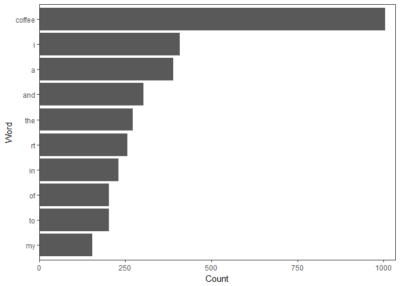
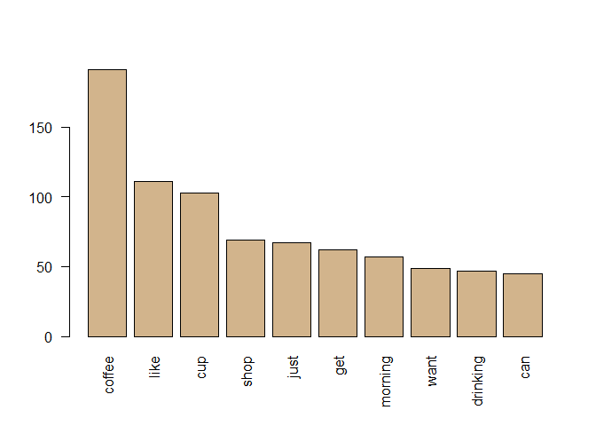
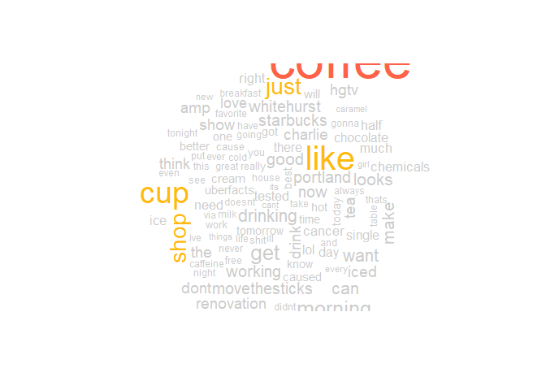
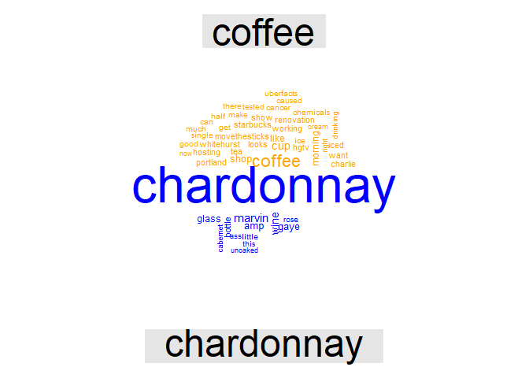
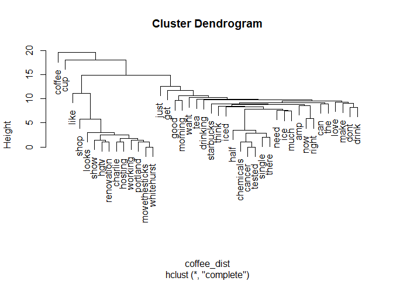
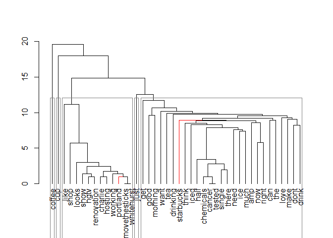

Coffee - Text Analsyis
================
Jae Wilson
2017-11-02

``` r
#install.packages("qdap", dependencies = TRUE)
#install.packages("tm", dependencies = TRUE)
#install.packages("wordcloud", dependencies = TRUE)
#install.packages("plotrix", dependencies = TRUE)
#install.packages("ggthemes", dependencies = TRUE)
#install.packages("RWeka" , dependencies = TRUE)
library(knitr)
library(magrittr)

library(qdap) #Quantitative Discourse Analysis Packag
library(tm) #text mining
library("wordcloud")
library("plotrix") #for pyramidcoud
library("dendextend")
library(ggplot2)
library(ggthemes)
library(RWeka)
```

Generate a Simple Corpus
------------------------

``` r
#import and isolate tweets
coffee_tweets<- read.csv("https://raw.githubusercontent.com/jaewilson07/Hello-World/master/Datasets/DataCamp/CoffeeTweets.txt", stringsAsFactors = FALSE)
chardonnay_tweets <- read.csv("https://raw.githubusercontent.com/jaewilson07/Hello-World/master/Datasets/DataCamp/ChardonnayTweets.txt", stringsAsFactors = FALSE)

coffee_tweets <- coffee_tweets$text
chardonnay_tweets <- chardonnay_tweets$text

#plot bag of words
coffee_freq <- freq_terms(coffee_tweets, 10)
plot(coffee_freq)
```



``` r
# Make a vector source (list): coffee_source
coffee_source <- VectorSource(coffee_tweets)
#NOTE:  DataframeSource() will convert entire row into ONE DOCUMENT
#NOTE : VectorSource( df[,2:4]) will convert entire df$column into one document (combine all observations)


# Make a volatile corpus: coffee_corpus
coffee_corpus <- VCorpus(coffee_source)

# Print out coffee_corpus
print(coffee_corpus)
```

    ## <<VCorpus>>
    ## Metadata:  corpus specific: 0, document level (indexed): 0
    ## Content:  documents: 1000

``` r
#Metadata:  corpus specific: 0, document level (indexed): 0
#Content:  documents: 1000

# Print data on the 15th tweet in coffee_corpus
print(coffee_corpus[[15]])
```

    ## <<PlainTextDocument>>
    ## Metadata:  7
    ## Content:  chars: 111

``` r
#Metadata:  7
#Content:  chars: 111


# Print the content of the 15th tweet in coffee_corpus
print(coffee_corpus[[15]][1])
```

    ## $content
    ## [1] "@HeatherWhaley I was about 2 joke it takes 2 hands to hold hot coffee...then I read headline! #Don'tDrinkNShoot"

``` r
#"@HeatherWhaley I was about 2 joke it takes 2 hands to hold hot coffee...then I read headline! #Don'tDrinkNShoot"
```

process corpus
--------------

Remove abbreviations, punctuation etc.

``` r
#create a function to apply transformations
clean_corpus <- function(corpus){
  corpus <- tm_map(corpus, content_transformer(replace_abbreviation))
  corpus <- tm_map(corpus, removePunctuation)
  corpus <- tm_map(corpus, removeNumbers)
  corpus <- tm_map(corpus, removeWords, c(stopwords("en"), "coffee"))
  corpus <- tm_map(corpus, content_transformer(tolower))
  return(corpus)
}
coffee_corpus_clean <- clean_corpus(coffee_corpus)

(coffee_dtm <- DocumentTermMatrix(coffee_corpus_clean))
```

    ## <<DocumentTermMatrix (documents: 1000, terms: 3098)>>
    ## Non-/sparse entries: 7772/3090228
    ## Sparsity           : 100%
    ## Maximal term length: 27
    ## Weighting          : term frequency (tf)

``` r
#DocumentTermMatrix (documents: 1000, terms: 3098)>>
#Non-/sparse entries: 7772/3090228
#Sparsity           : 100%
#Maximal term length: 27
#Weighting          : term frequency (tf)

coffee_m <- as.matrix(coffee_dtm)
dim(coffee_m) #there are 1000 documents and 3098 unique words in coffee_m
```

    ## [1] 1000 3098

``` r
(coffee_tdm <- TermDocumentMatrix(coffee_corpus_clean))
```

    ## <<TermDocumentMatrix (terms: 3098, documents: 1000)>>
    ## Non-/sparse entries: 7772/3090228
    ## Sparsity           : 100%
    ## Maximal term length: 27
    ## Weighting          : term frequency (tf)

``` r
coffee_m <- as.matrix(coffee_tdm)
dim(coffee_m) #there are 1000 documents and 3098 unique words in coffee_m
```

    ## [1] 3098 1000

``` r
term_frequency <- rowSums(coffee_m) %>%
    sort(decreasing = TRUE)
barplot(term_frequency[1:10], col = "tan", las = 2)
```



``` r
qdapFreq <- freq_terms(
    coffee_tweets,
    top = 10,
    at.least = 3, #number of characters in vector
    stopwords = "Top200Words")
plot(qdapFreq)
```


``` r
wordcloud(coffee_corpus_clean
          , max.words = 100
          , random.order = TRUE
          ,  colors = c("grey80", "darkgoldenrod1",  "tomato")
          )
```



Stem Completion
---------------

Reduce the number of words by matching word variations to their stem/root word

``` r
text_data <- "In a complicated haste, Tom rushed to fix a new complication, too complicatedly"

# Remove punctuation: rm_punc
rm_punc <- removePunctuation(text_data)

# Create character vector: n_char_vec
n_char_vec <- unlist(strsplit(rm_punc, split = ' '))
#stem document will consider each element of a vector as one word.
#use strsplit() to break a sentence into vectors of words

str(n_char_vec)
```

    ##  chr [1:13] "In" "a" "complicated" "haste" "Tom" "rushed" "to" "fix" ...

``` r
#chr [1:13] "In" "a" "complicated" "haste" "Tom" "rushed" "to" "fix" "a" ...

# Perform word stemming: stem_doc
stem_doc <- stemDocument(n_char_vec)
# [1] "In"      "a"       "complic" "hast"    "Tom"     "rush"    "to"     
# [8] "fix"     "a"       "new"     "complic" "too"     "complic"

# Print stem_doc
print(stem_doc)
```

    ##  [1] "In"      "a"       "complic" "hast"    "Tom"     "rush"    "to"     
    ##  [8] "fix"     "a"       "new"     "complic" "too"     "complic"

``` r
comp_dict <- c("In", "a", "complicate", "haste", "Tom", "rush", "to", "fix", "a", "new", "too")

# Re-complete stemmed document: complete_doc
#the stemCompletion is a complete list of all the 'valid' words
complete_doc <-stemCompletion(stem_doc, comp_dict) 

# Print complete_doc
complete_doc
```

    ##           In            a      complic         hast          Tom 
    ##         "In"          "a" "complicate"      "haste"        "Tom" 
    ##         rush           to          fix            a          new 
    ##       "rush"         "to"        "fix"          "a"        "new" 
    ##      complic          too      complic 
    ## "complicate"        "too" "complicate"

understanding color in visualization
------------------------------------

``` r
# List the available colors
display.brewer.all()
```


``` r
# Create purple_orange
purple_orange <- brewer.pal(10, "PuOr")

# Drop 2 faintest colors
purple_orange <- purple_orange[-(1:2)]
```

Visualizing Corpus
------------------

### Combine Corpus

``` r
# Create all_coffee
#collapse into one big ass string
all_coffee <- paste(coffee_tweets, collapse = " ")

# Create all_chardonnay
all_chardonnay <- paste(chardonnay_tweets, collapse = " ")

# combine tweets into a 2 element vector
all_tweets <- c(all_coffee, all_chardonnay)

# Convert to a vector source  
all_tweets <- VectorSource(all_tweets)

# Create all_corpus
all_corpus <- VCorpus(all_tweets)

# Clean the corpus
all_clean <- clean_corpus(all_corpus)

# Create all_tdm
all_tdm <- TermDocumentMatrix(all_clean)
str(all_tdm)
```

    ## List of 6
    ##  $ i       : int [1:6212] 2 3 4 5 6 7 8 9 11 15 ...
    ##  $ j       : int [1:6212] 1 1 1 1 1 1 1 1 1 1 ...
    ##  $ v       : num [1:6212] 1 1 1 1 1 1 1 1 1 1 ...
    ##  $ nrow    : int 5491
    ##  $ ncol    : int 2
    ##  $ dimnames:List of 2
    ##   ..$ Terms: chr [1:5491] "aaliyahmaxwell" "abasc" "abbslovesfed" "abbycastro" ...
    ##   ..$ Docs : chr [1:2] "1" "2"
    ##  - attr(*, "class")= chr [1:2] "TermDocumentMatrix" "simple_triplet_matrix"
    ##  - attr(*, "weighting")= chr [1:2] "term frequency" "tf"

``` r
# Create all_m
all_m <- as.matrix(all_tdm)

# Print a commonality cloud
commonality.cloud(all_m
  , colors = "steelblue1"
  , max.words = 100)
```


### Compare Corpus

``` r
# Clean the corpus
all_clean <- clean_corpus(all_corpus)

# Create all_tdm
all_tdm <- TermDocumentMatrix(all_clean)

# Give the columns distinct names
colnames(all_tdm) <- c("coffee", "chardonnay")

# Create all_m
all_tdm_m <- as.matrix(all_tdm)

# Create comparison cloud
comparison.cloud(all_tdm_m
  , colors= c("orange", "blue")
  , max.words = 50)
```



### Polarized Cloud

show top 25 words shared in each corpus show the absolute difference between words represented in each corpus (top should have the least difference in word representation) eg. Cup is common to both corpuses, but Chardonnay tweeters use cup MUCH MORE frequently than Coffee tweeters.

``` r
# Create common_words
common_words <- subset(all_tdm_m, all_tdm_m[, 1] > 0 & all_tdm_m[, 2] > 0)

# Create difference
difference <- abs(common_words[, 1] - common_words[, 2])

# Combine common_words and difference
common_words <- cbind(common_words, difference)

# Order the data frame from most differences to least
common_words <- common_words[order(common_words[, 3], decreasing = TRUE), ]

# Create top25_df
top25_df <- data.frame(x = common_words[1:25, 1], 
                       y =common_words[1:25, 2], 
                       labels = rownames(common_words[1:25, ]))

# Create the pyramid plot
pyramid.plot(top25_df$x, top25_df$y 
  ,labels = top25_df$labels
  , top.labels = c("Chardonnay", "Words", "Coffee")
  , gap = 20
  , space= .3
  , main = "Words in Common"
  , raxlab = NULL
  , laxlab = NULL
  , unit = NULL
  )
```


    ## [1] 5.1 4.1 4.1 2.1

``` r
# Word association
word_associate(coffee_tweets, match.string = c("barista"), 
               stopwords = c(Top200Words, "coffee", "amp"), 
               network.plot = TRUE, cloud.colors = c("gray85", "darkred"))
```

    ## Warning in text2color(words = V(g)$label, recode.words = target.words,
    ## colors = label.colors): length of colors should be 1 more than length of
    ## recode.words

    ##   row group unit text                                                                                                                                
    ## 1 544   all  544 RT @Barista_kyo: #coffee #latte #soylatte #thinkcoffee # # # # @ think coffee http://t.co/Hmy9RPRWTZ                                
    ## 2 569   all  569 RT @ReversoSmith: What a beautiful mess! #portafilter #coffee #espresso #coffeemachine #barista #baristalife? http://t.co/ZODcTfP22Z
    ## 3 658   all  658 The moment you realize your Starbucks barista gave you a regular iced Coffee when u asked 4 decaf. Shitty. Late night not planned.  
    ## 4 931   all  931 Barista made my coffee wrong and still gave me both anyway #Starbucks #coffee #caffeine #upallnight http://t.co/iKCNwO8F6t          
    ## 5 951   all  951 RT @FrankIero: hahaha @jamiasan :*gives Barista our Starbucks order* Barista: coffee? @jamiasan : yes, isn't this is a coffee store?

``` r
# Add title
title(main = "Barista Coffee Tweet Associations")
```


additional skills for improving text mining
-------------------------------------------

### understanding hclusts and dendrograms

``` r
rain <- data.frame( "city" = as.factor(c("Portland", "Cleveland", "Boston", "New Orleans"))
                    , "rainfall" = c( 39.1, 39.1, 43.8, 62.5))

str(rain)
```

    ## 'data.frame':    4 obs. of  2 variables:
    ##  $ city    : Factor w/ 4 levels "Boston","Cleveland",..: 4 2 1 3
    ##  $ rainfall: num  39.1 39.1 43.8 62.5

``` r
# Create dist_rain
dist_rain <- dist(rain$rainfall)

# View the distance matrix
print(dist_rain)
```

    ##      1    2    3
    ## 2  0.0          
    ## 3  4.7  4.7     
    ## 4 23.4 23.4 18.7

``` r
# Create hc
hc <- hclust(dist_rain)

# Plot hc
plot(hc, labels = rain$city)
```


### Cleaning up dendrograms by reducing Sparsity

Limit the number of words in your TDM using removeSparseTerms() from tm.

Why would you want to adjust the sparsity of the TDM/DTM? TDMs and DTMs are sparse, meaning they contain mostly zeros.

-   A good TDM has between 25 and 70 terms.
-   The lower the sparse value, the more terms are kept. The closer it is to 1, the fewer are kept.

-   This value is a percentage cutoff of zeros for each term in the TDM.

``` r
# Print the dimensions of tweets_tdm
dim(coffee_tdm)
```

    ## [1] 3098 1000

``` r
# Create tdm1
tdm1 <- removeSparseTerms(coffee_tdm, sparse = .965)

# Create tdm2
tdm2 <- removeSparseTerms(coffee_tdm, sparse = .98)

# Print tdm1
print(tdm1)
```

    ## <<TermDocumentMatrix (terms: 27, documents: 1000)>>
    ## Non-/sparse entries: 1408/25592
    ## Sparsity           : 95%
    ## Maximal term length: 13
    ## Weighting          : term frequency (tf)

``` r
# Print tdm2
print(tdm2)
```

    ## <<TermDocumentMatrix (terms: 50, documents: 1000)>>
    ## Non-/sparse entries: 2060/47940
    ## Sparsity           : 96%
    ## Maximal term length: 13
    ## Weighting          : term frequency (tf)

``` r
# Create tweets_tdm2
coffee_tdm2 <- removeSparseTerms(coffee_tdm, sparse= .975)

# Create tdm_m
coffee_m <-as.matrix(coffee_tdm2)

# Create tdm_df
coffee_df <- as.data.frame(coffee_m)

# Create tweets_dist
coffee_dist <- dist(coffee_df)

# Create hc
hc <- hclust(coffee_dist)

plot(hc)
```



``` r
# Create hc
coffee_hc<-hclust(coffee_dist)

# Create hcd
coffee_hcd <- as.dendrogram(coffee_hc)

# Print the labels in hcd
labels(coffee_hcd)
```

    ##  [1] "coffee"        "cup"           "like"          "shop"         
    ##  [5] "looks"         "show"          "hgtv"          "renovation"   
    ##  [9] "charlie"       "hosting"       "working"       "portland"     
    ## [13] "movethesticks" "whitehurst"    "just"          "get"          
    ## [17] "good"          "morning"       "want"          "tea"          
    ## [21] "drinking"      "starbucks"     "think"         "iced"         
    ## [25] "half"          "chemicals"     "cancer"        "tested"       
    ## [29] "single"        "there"         "need"          "ice"          
    ## [33] "much"          "amp"           "now"           "right"        
    ## [37] "can"           "the"           "love"          "make"         
    ## [41] "dont"          "drink"

``` r
# Change the branch color to red for "marvin" and "gaye"
coffee_hcd<- branches_attr_by_labels(coffee_hcd, c("starbucks", "portland") , col="red")

# Plot hcd
plot(coffee_hcd)

# Add cluster rectangles 
rect.dendrogram(coffee_hcd, k=5, border ="grey50")
```



### using Associations to analyze data

Use findAssocs() function in the tm package.

For any given word, findAssocs() calculates correlation with every other word in a TDM or DTM. \* Scores range from 0 to 1. \* Where 1 means that two words always appear together \* Minimum correlation values are often relatively low because of word diversity. (0.10 could demonstrate a strong pairwise term association)

``` r
# Create associations
associations <- findAssocs(coffee_tdm, "venti", .2)

# View the venti associations
class(associations)
```

    ## [1] "list"

``` r
print(associations)
```

    ## $venti
    ##     breve   drizzle    entire     pumps     extra       cuz    forget 
    ##      0.58      0.58      0.58      0.58      0.47      0.41      0.41 
    ##      okay     hyper     mocha   vanilla       wtf    always    asleep 
    ##      0.41      0.33      0.33      0.33      0.29      0.26      0.26 
    ##       get starbucks     white 
    ##      0.25      0.25      0.23

``` r
# Create associations_df
associations_df <- list_vect2df(associations)[, 2:3]

# Plot the associations_df values
ggplot(associations_df, aes(y = associations_df[, 1])) + 
  geom_point(aes(x = associations_df[, 2]), data = associations_df, size = 3) + 
  theme_gdocs() +
  labs(title = "Word Associations with \'Venti\'", x = "Correlation", y ="Assoc. Word")
```


Tokenizer
---------

The default DTM is unigrams \* can use tokeinzer to create bi / tri grams (w two or more words per token). \* help extract useful phrases can lead to some additional insights \* improved predictive attributes for a machine learning algorithm.

Customized tokenizer() function can be passed into the TermDocumentMatrix or DocumentTermMatrix functions as an additional parameter \* Note: creates significantly larger DTMs

``` r
# Make tokenizer function 
tokenizer <- function(x) {
  NGramTokenizer(x, Weka_control(min=2, max=2))
}

# Create unigram_dtm
unigram_dtm <- DocumentTermMatrix(coffee_corpus_clean)

# Create bigram_dtm
bigram_dtm <- DocumentTermMatrix(coffee_corpus_clean, control = list(tokenize = tokenizer))

# Examine unigram_dtm
print(unigram_dtm)
```

    ## <<DocumentTermMatrix (documents: 1000, terms: 3098)>>
    ## Non-/sparse entries: 7772/3090228
    ## Sparsity           : 100%
    ## Maximal term length: 27
    ## Weighting          : term frequency (tf)

``` r
# Examine bigram_dtm
print(bigram_dtm)
```

    ## <<DocumentTermMatrix (documents: 1000, terms: 6015)>>
    ## Non-/sparse entries: 8081/6006919
    ## Sparsity           : 100%
    ## Maximal term length: 40
    ## Weighting          : term frequency (tf)

``` r
# Create bigram_dtm_m
bigram_dtm_m <- as.matrix(bigram_dtm)
unigram_dtm_m <- as.matrix(unigram_dtm)

# Create freq
coffee_bi_freq <- colSums(bigram_dtm_m)
coffee_un_freq <- colSums(unigram_dtm_m)

# Create bi_words
coffee_bi_words <- names(coffee_bi_freq)
coffee_un_words <- names(coffee_un_freq)

# Examine part of bi_words
print(coffee_bi_words[2577:2587])
```

    ##  [1] "i word"              "i work"              "i worked"           
    ##  [4] "i wouldnt"           "iacc right"          "iambeyer im"        
    ##  [7] "iamnate no"          "icamagpantay coffee" "ice cream"          
    ## [10] "ice cube"            "ice good"

``` r
# Plot a wordcloud
par(mfrow=c(1,2))
wordcloud(coffee_un_words, coffee_un_freq, max.words =30)
wordcloud(coffee_bi_words, coffee_bi_freq, max.words= 30)
```

    ## Warning in wordcloud(coffee_bi_words, coffee_bi_freq, max.words = 30): like
    ## working could not be fit on page. It will not be plotted.

    ## Warning in wordcloud(coffee_bi_words, coffee_bi_freq, max.words = 30):
    ## renovation show could not be fit on page. It will not be plotted.

    ## Warning in wordcloud(coffee_bi_words, coffee_bi_freq, max.words = 30): rt
    ## movethesticks could not be fit on page. It will not be plotted.

    ## Warning in wordcloud(coffee_bi_words, coffee_bi_freq, max.words = 30): of
    ## tested could not be fit on page. It will not be plotted.

    ## Warning in wordcloud(coffee_bi_words, coffee_bi_freq, max.words = 30):
    ## there chemicals could not be fit on page. It will not be plotted.

    ## Warning in wordcloud(coffee_bi_words, coffee_bi_freq, max.words = 30):
    ## movethesticks charlie could not be fit on page. It will not be plotted.

    ## Warning in wordcloud(coffee_bi_words, coffee_bi_freq, max.words = 30):
    ## right now could not be fit on page. It will not be plotted.

    ## Warning in wordcloud(coffee_bi_words, coffee_bi_freq, max.words = 30):
    ## tested half could not be fit on page. It will not be plotted.

    ## Warning in wordcloud(coffee_bi_words, coffee_bi_freq, max.words = 30): ice
    ## cream could not be fit on page. It will not be plotted.

    ## Warning in wordcloud(coffee_bi_words, coffee_bi_freq, max.words = 30): cup
    ## of could not be fit on page. It will not be plotted.

    ## Warning in wordcloud(coffee_bi_words, coffee_bi_freq, max.words = 30):
    ## portland hosting could not be fit on page. It will not be plotted.

    ## Warning in wordcloud(coffee_bi_words, coffee_bi_freq, max.words = 30):
    ## chemicals single could not be fit on page. It will not be plotted.

    ## Warning in wordcloud(coffee_bi_words, coffee_bi_freq, max.words = 30):
    ## charlie whitehurst could not be fit on page. It will not be plotted.

    ## Warning in wordcloud(coffee_bi_words, coffee_bi_freq, max.words = 30):
    ## hosting renovation could not be fit on page. It will not be plotted.

    ## Warning in wordcloud(coffee_bi_words, coffee_bi_freq, max.words = 30): i
    ## want could not be fit on page. It will not be plotted.

    ## Warning in wordcloud(coffee_bi_words, coffee_bi_freq, max.words = 30): i
    ## dont could not be fit on page. It will not be plotted.

    ## Warning in wordcloud(coffee_bi_words, coffee_bi_freq, max.words = 30): shop
    ## portland could not be fit on page. It will not be plotted.

    ## Warning in wordcloud(coffee_bi_words, coffee_bi_freq, max.words = 30):
    ## whitehurst looks could not be fit on page. It will not be plotted.

    ## Warning in wordcloud(coffee_bi_words, coffee_bi_freq, max.words = 30):
    ## working shop could not be fit on page. It will not be plotted.


