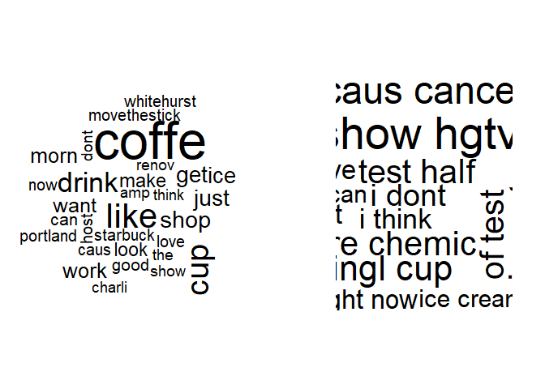

Coffee - Text Analsyis
================
Jae Wilson
2017-11-09

Setup
=====

``` r
# install.packages("qdap", dependencies = TRUE)
# install.packages("tm", dependencies = TRUE)
# install.packages("wordcloud", dependencies = TRUE)
# install.packages("plotrix", dependencies = TRUE)
# install.packages("ggthemes", dependencies = TRUE)
# install.packages("RWeka" , dependencies = TRUE)

library(knitr)
library(magrittr)

library(qdap) #Quantitative Discourse Analysis Packag
library(tm) #text mining
library("wordcloud")
library("plotrix") #for pyramidcoud
library("dendextend")
library(ggplot2)
library(ggthemes)
library(RWeka)

library(dplyr)
library(tidytext)
```

``` r
# create a custom reader for capturing metadata
custom_reader <- readTabular(mapping = list(content = "text", 
                                            id = "num", 
                                            author = "screenName", 
                                            date = "created"))

#create a function to apply transformations
#use content_transformer to inform tm_map that you'd like to 'transform content'
#NOTE: when using cleansing functions from tm library no content_transformer required()
clean_corpus_coffee <- function(corpus){
  corpus <- tm_map(corpus, content_transformer(replace_abbreviation))
  corpus <- tm_map(corpus, removePunctuation)
  corpus <- tm_map(corpus, removeNumbers)
  corpus <- tm_map(corpus, removeWords, stopwordLibraryCoffee)
  corpus <- tm_map(corpus, content_transformer(tolower))
  corpus <- tm_map(corpus, stemDocument, language = "english")
  return(corpus)
}

clean_corpus_chardonnay <- function(corpus){
  corpus <- tm_map(corpus, content_transformer(replace_abbreviation))
  corpus <- tm_map(corpus, removePunctuation)
  corpus <- tm_map(corpus, removeNumbers)
  corpus <- tm_map(corpus, removeWords, stopwordLibraryChardonnay)
  corpus <- tm_map(corpus, content_transformer(tolower))
  corpus <- tm_map(corpus, stemDocument, language = "english")
  return(corpus)
}

# Make tokenizer function 
tokenizer <- function(x) {
  NGramTokenizer(x, Weka_control(min=2, max=2))
}
```

``` r
stopwordLibraryCoffee <- c(stopwords("en"), "coffee")
stopwordLibraryChardonnay <- c(stopwords("en"), "chardonnay")
#import and isolate tweets
coffee_tweets_df<- read.csv("https://raw.githubusercontent.com/jaewilson07/Hello-World/master/Datasets/DataCamp/CoffeeTweets.txt", stringsAsFactors = FALSE)
chardonnay_tweets_df <- read.csv("https://raw.githubusercontent.com/jaewilson07/Hello-World/master/Datasets/DataCamp/ChardonnayTweets.txt", stringsAsFactors = FALSE) %>%
  rename( num = X)
```

Bag of Words
============

Define Corpuses
---------------

``` r
coffee_tweets <- coffee_tweets_df$text
chardonnay_tweets <- chardonnay_tweets_df$text

# Make a vector source (list): coffee_source
coffee_vec_source <- VectorSource(coffee_tweets)
coffee_vec_corpus <- VCorpus(coffee_vec_source)


# Print out coffee_corpus
print(coffee_vec_corpus)
```

    ## <<VCorpus>>
    ## Metadata:  corpus specific: 0, document level (indexed): 0
    ## Content:  documents: 1000

``` r
# Print data on the 15th tweet in coffee_corpus
print(coffee_vec_corpus[[15]])
```

    ## <<PlainTextDocument>>
    ## Metadata:  7
    ## Content:  chars: 111

``` r
# Print the content of the 15th tweet in coffee_corpus
print(coffee_vec_corpus[[15]][1])
```

    ## $content
    ## [1] "@HeatherWhaley I was about 2 joke it takes 2 hands to hold hot coffee...then I read headline! #Don'tDrinkNShoot"

``` r
#"@HeatherWhaley I was about 2 joke it takes 2 hands to hold hot coffee...then I read headline! #Don'tDrinkNShoot"


#NOTE:  DataframeSource() will convert entire row into ONE DOCUMENT (retain independent tweets structure)
#NOTE : VectorSource(sample_df) will convert entire sample_df$data1 into one document (combine all variables)
#sample_df <- data.frame( data1 = c("Apples and bananas" , "I think i need to drink coffee"),
            # data2 = c( "Pears, plums and peaches", "This is how we suffer through bad classes, #Starbucks" )) %>%
#  VectorSource()
#print(sample_df)
```

``` r
# Make corpus which includes metadata by adding readerControl
coffee_df_corpus <- VCorpus( 
  DataframeSource(coffee_tweets_df),
  readerControl = list(reader = custom_reader)) %>%
  clean_corpus_coffee()

chardonnay_df_corpus <- VCorpus( 
  DataframeSource(chardonnay_tweets_df),
  readerControl = list(reader = custom_reader)) %>%
  clean_corpus_chardonnay()

# Print data
#str coffee_corpus
# NOTE: syntax for selecting one liste item
str(coffee_df_corpus[[1]])
```

    ## List of 2
    ##  $ content: chr "ayyytylerb true drink lot"
    ##  $ meta   :List of 4
    ##   ..$ id      : chr "1"
    ##   ..$ author  : chr "thejennagibson"
    ##   ..$ date    : chr "8/9/2013 2:43"
    ##   ..$ language: chr "en"
    ##   ..- attr(*, "class")= chr "TextDocumentMeta"
    ##  - attr(*, "class")= chr [1:2] "PlainTextDocument" "TextDocument"

``` r
print(coffee_df_corpus[[1]][1])
```

    ## $content
    ## [1] "ayyytylerb true drink lot"

``` r
print(coffee_df_corpus[[1]][2])
```

    ## $meta
    ##   id      : 1
    ##   author  : thejennagibson
    ##   date    : 8/9/2013 2:43
    ##   language: en

DTMs and Frequencies
--------------------

``` r
##DTM vs TDM simply transposes the length / width of the resulting matrix
(coffee_df_dtm <- DocumentTermMatrix(coffee_df_corpus))
```

    ## <<DocumentTermMatrix (documents: 1000, terms: 2798)>>
    ## Non-/sparse entries: 7728/2790272
    ## Sparsity           : 100%
    ## Maximal term length: 27
    ## Weighting          : term frequency (tf)

``` r
coffee_m_dtm <- as.matrix(coffee_df_dtm)

(coffee_df_tdm <- TermDocumentMatrix(coffee_df_corpus))
```

    ## <<TermDocumentMatrix (terms: 2798, documents: 1000)>>
    ## Non-/sparse entries: 7728/2790272
    ## Sparsity           : 100%
    ## Maximal term length: 27
    ## Weighting          : term frequency (tf)

``` r
coffee_m_tdm <- as.matrix(coffee_df_tdm)

chardonnay_df_tdm <-TermDocumentMatrix(chardonnay_df_corpus)
chardonnay_m_tdm <- as.matrix(chardonnay_df_tdm)

#there are 1000 documents and 3098 unique words in coffee_m
dim(coffee_m_dtm) 
```

    ## [1] 1000 2798

``` r
dim(coffee_m_tdm) 
```

    ## [1] 2798 1000

``` r
#plot simple bag of words (frequency of each word)
#using qdap library freq_terms()
#NOTE: inclusion of uninformative words
coffee_freq <- freq_terms(
  coffee_tweets, 
  top= 10)
plot(coffee_freq)
```


``` r
#NOTE: parameters to exclude Top200 stopwords as well words with fewer than 3 characters
coffee_freq <- freq_terms(
    coffee_tweets,
    top = 10,
    at.least = 3, #number of characters in vector
    stopwords = "Top200Words")
plot(coffee_freq)
```


``` r
#alternatively, use rowSums() on the coffee DTM matrix to generate a summary matrix
#NOTE: applcaition of sort() function on matrix
#NOTE: using stowords("en") library + Coffee
coffee_freq <- rowSums(coffee_m_tdm) %>%
    sort(decreasing = TRUE)
barplot(coffee_freq[1:10], col = "tan", las = 2)
```


``` r
wordcloud(coffee_df_corpus
          , max.words = 100
          , random.order = TRUE
          ,  colors = c("grey80", "darkgoldenrod1",  "tomato")
          )
```


Stem Completion
---------------

Reduce the number of words by matching word variations to their stem/root word

``` r
text_data <- "In a complicated haste, Tom rushed to fix a new complication, too complicatedly"

# Remove punctuation: rm_punc
rm_punc <- removePunctuation(text_data)

# Create character vector: n_char_vec
n_char_vec <- unlist(strsplit(rm_punc, split = ' '))
#stem document will consider each element of a vector as one word.
#use strsplit() to break a sentence into vectors of words

str(n_char_vec)
```

    ##  chr [1:13] "In" "a" "complicated" "haste" "Tom" "rushed" "to" "fix" ...

``` r
#chr [1:13] "In" "a" "complicated" "haste" "Tom" "rushed" "to" "fix" "a" ...

# Perform word stemming: stem_doc
stem_doc <- stemDocument(n_char_vec)
# [1] "In"      "a"       "complic" "hast"    "Tom"     "rush"    "to"     
# [8] "fix"     "a"       "new"     "complic" "too"     "complic"

# Print stem_doc
print(stem_doc)
```

    ##  [1] "In"      "a"       "complic" "hast"    "Tom"     "rush"    "to"     
    ##  [8] "fix"     "a"       "new"     "complic" "too"     "complic"

``` r
comp_dict <- c("In", "a", "complicate", "haste", "Tom", "rush", "to", "fix", "a", "new", "too")

# Re-complete stemmed document: complete_doc
#the stemCompletion is a complete list of all the 'valid' words
complete_doc <-stemCompletion(stem_doc, comp_dict) 


# Print complete_doc
complete_doc
```

    ##           In            a      complic         hast          Tom 
    ##         "In"          "a" "complicate"      "haste"        "Tom" 
    ##         rush           to          fix            a          new 
    ##       "rush"         "to"        "fix"          "a"        "new" 
    ##      complic          too      complic 
    ## "complicate"        "too" "complicate"

``` r
#UNFINISHED ATTEMPT TO CREATE A VALID STEMCOMPLETION DOCUMENT
#stem_coffee_corp <- tm_map(coffee_df_corpus, stemDocument, language = "en")
#stem_coffee_m_tdm <- stem_coffee_corp %>%
#  TermDocumentMatrix() %>%
#  as.matrix()

#all_coffee_words <- paste( rownames(coffee_m_tdm), collapse =  " " )
#all_coffee_stem <- paste( rownames(stem_coffee_m_tdm), collapse = " " )
# all_coffee_stem <- c(all_coffee_words, all_coffee_stem) %>%
#   VectorSource() %>%
#   VCorpus() %>%
#   TermDocumentMatrix()
# 
# all_coffee_stem <- as.matrix(all_coffee_stem)
# 
# head(all_coffee_stem, 100)
# 
# stemmed_coffee <- subset(all_coffee_stem , all_coffee_stem[,1] == 0 & all_coffee_stem[,2] >0)
# stemmed_coffee
```

understanding color in visualization
------------------------------------

``` r
# List the available colors
display.brewer.all()
```


``` r
# Create purple_orange
purple_orange <- brewer.pal(10, "PuOr")

# Drop 2 faintest colors
purple_orange <- purple_orange[-(1:2)]
```

Visualizing Corpus
------------------

### Combine Corpus

Combine two corpus to see commonality

``` r
#collapse into one big ass string
all_coffee_words <- paste( rownames(coffee_m_tdm), collapse =  " " )

#CODE VARIANT: using df, all_coffee_words <- paste(coffee_tweets, collapse = " ")

# Create all_chardonnay
all_chardonnay_words <- paste( rownames(chardonnay_m_tdm), collapse = " " )

# combine tweets into a 2 element vector
all_words <- c(all_coffee_words, all_chardonnay_words) %>%
  VectorSource() %>%
  VCorpus() %>%
  clean_corpus_chardonnay()

all_tdm <- TermDocumentMatrix(all_words) %>%
  `colnames<-` (c("coffee", "chardonnay"))

all_m_tdm <- as.matrix(all_tdm)

# Print a commonality cloud
commonality.cloud(all_m_tdm
  , colors = "steelblue1"
  , max.words = 100)
```

    ## Warning in wordcloud(rownames(term.matrix)[freq > 0], freq[freq > 0],
    ## min.freq = 0, : queen could not be fit on page. It will not be plotted.

    ## Warning in wordcloud(rownames(term.matrix)[freq > 0], freq[freq > 0],
    ## min.freq = 0, : suggest could not be fit on page. It will not be plotted.

    ## Warning in wordcloud(rownames(term.matrix)[freq > 0], freq[freq > 0],
    ## min.freq = 0, : area could not be fit on page. It will not be plotted.

    ## Warning in wordcloud(rownames(term.matrix)[freq > 0], freq[freq > 0],
    ## min.freq = 0, : order could not be fit on page. It will not be plotted.

    ## Warning in wordcloud(rownames(term.matrix)[freq > 0], freq[freq > 0],
    ## min.freq = 0, : beat could not be fit on page. It will not be plotted.

    ## Warning in wordcloud(rownames(term.matrix)[freq > 0], freq[freq > 0],
    ## min.freq = 0, : outrag could not be fit on page. It will not be plotted.

    ## Warning in wordcloud(rownames(term.matrix)[freq > 0], freq[freq > 0],
    ## min.freq = 0, : hous could not be fit on page. It will not be plotted.

    ## Warning in wordcloud(rownames(term.matrix)[freq > 0], freq[freq > 0],
    ## min.freq = 0, : sing could not be fit on page. It will not be plotted.

    ## Warning in wordcloud(rownames(term.matrix)[freq > 0], freq[freq > 0],
    ## min.freq = 0, : babe could not be fit on page. It will not be plotted.

    ## Warning in wordcloud(rownames(term.matrix)[freq > 0], freq[freq > 0],
    ## min.freq = 0, : vanilla could not be fit on page. It will not be plotted.

    ## Warning in wordcloud(rownames(term.matrix)[freq > 0], freq[freq > 0],
    ## min.freq = 0, : jamaican could not be fit on page. It will not be plotted.

    ## Warning in wordcloud(rownames(term.matrix)[freq > 0], freq[freq > 0],
    ## min.freq = 0, : award could not be fit on page. It will not be plotted.

    ## Warning in wordcloud(rownames(term.matrix)[freq > 0], freq[freq > 0],
    ## min.freq = 0, : stop could not be fit on page. It will not be plotted.

    ## Warning in wordcloud(rownames(term.matrix)[freq > 0], freq[freq > 0],
    ## min.freq = 0, : name could not be fit on page. It will not be plotted.

    ## Warning in wordcloud(rownames(term.matrix)[freq > 0], freq[freq > 0],
    ## min.freq = 0, : dick could not be fit on page. It will not be plotted.

    ## Warning in wordcloud(rownames(term.matrix)[freq > 0], freq[freq > 0],
    ## min.freq = 0, : sea could not be fit on page. It will not be plotted.

    ## Warning in wordcloud(rownames(term.matrix)[freq > 0], freq[freq > 0],
    ## min.freq = 0, : funni could not be fit on page. It will not be plotted.

    ## Warning in wordcloud(rownames(term.matrix)[freq > 0], freq[freq > 0],
    ## min.freq = 0, : shop could not be fit on page. It will not be plotted.

    ## Warning in wordcloud(rownames(term.matrix)[freq > 0], freq[freq > 0],
    ## min.freq = 0, : vodka could not be fit on page. It will not be plotted.

    ## Warning in wordcloud(rownames(term.matrix)[freq > 0], freq[freq > 0],
    ## min.freq = 0, : store could not be fit on page. It will not be plotted.

    ## Warning in wordcloud(rownames(term.matrix)[freq > 0], freq[freq > 0],
    ## min.freq = 0, : serv could not be fit on page. It will not be plotted.

    ## Warning in wordcloud(rownames(term.matrix)[freq > 0], freq[freq > 0],
    ## min.freq = 0, : money could not be fit on page. It will not be plotted.

    ## Warning in wordcloud(rownames(term.matrix)[freq > 0], freq[freq > 0],
    ## min.freq = 0, : price could not be fit on page. It will not be plotted.

    ## Warning in wordcloud(rownames(term.matrix)[freq > 0], freq[freq > 0],
    ## min.freq = 0, : sleep could not be fit on page. It will not be plotted.

    ## Warning in wordcloud(rownames(term.matrix)[freq > 0], freq[freq > 0],
    ## min.freq = 0, : london could not be fit on page. It will not be plotted.

    ## Warning in wordcloud(rownames(term.matrix)[freq > 0], freq[freq > 0],
    ## min.freq = 0, : cant could not be fit on page. It will not be plotted.

    ## Warning in wordcloud(rownames(term.matrix)[freq > 0], freq[freq > 0],
    ## min.freq = 0, : look could not be fit on page. It will not be plotted.

    ## Warning in wordcloud(rownames(term.matrix)[freq > 0], freq[freq > 0],
    ## min.freq = 0, : word could not be fit on page. It will not be plotted.

    ## Warning in wordcloud(rownames(term.matrix)[freq > 0], freq[freq > 0],
    ## min.freq = 0, : hand could not be fit on page. It will not be plotted.

    ## Warning in wordcloud(rownames(term.matrix)[freq > 0], freq[freq > 0],
    ## min.freq = 0, : turn could not be fit on page. It will not be plotted.

    ## Warning in wordcloud(rownames(term.matrix)[freq > 0], freq[freq > 0],
    ## min.freq = 0, : said could not be fit on page. It will not be plotted.

    ## Warning in wordcloud(rownames(term.matrix)[freq > 0], freq[freq > 0],
    ## min.freq = 0, : snack could not be fit on page. It will not be plotted.

    ## Warning in wordcloud(rownames(term.matrix)[freq > 0], freq[freq > 0],
    ## min.freq = 0, : bread could not be fit on page. It will not be plotted.

    ## Warning in wordcloud(rownames(term.matrix)[freq > 0], freq[freq > 0],
    ## min.freq = 0, : mean could not be fit on page. It will not be plotted.

    ## Warning in wordcloud(rownames(term.matrix)[freq > 0], freq[freq > 0],
    ## min.freq = 0, : havent could not be fit on page. It will not be plotted.

    ## Warning in wordcloud(rownames(term.matrix)[freq > 0], freq[freq > 0],
    ## min.freq = 0, : less could not be fit on page. It will not be plotted.

    ## Warning in wordcloud(rownames(term.matrix)[freq > 0], freq[freq > 0],
    ## min.freq = 0, : problem could not be fit on page. It will not be plotted.

    ## Warning in wordcloud(rownames(term.matrix)[freq > 0], freq[freq > 0],
    ## min.freq = 0, : three could not be fit on page. It will not be plotted.

    ## Warning in wordcloud(rownames(term.matrix)[freq > 0], freq[freq > 0],
    ## min.freq = 0, : hurt could not be fit on page. It will not be plotted.

    ## Warning in wordcloud(rownames(term.matrix)[freq > 0], freq[freq > 0],
    ## min.freq = 0, : weather could not be fit on page. It will not be plotted.

    ## Warning in wordcloud(rownames(term.matrix)[freq > 0], freq[freq > 0],
    ## min.freq = 0, : fave could not be fit on page. It will not be plotted.

    ## Warning in wordcloud(rownames(term.matrix)[freq > 0], freq[freq > 0],
    ## min.freq = 0, : though could not be fit on page. It will not be plotted.

    ## Warning in wordcloud(rownames(term.matrix)[freq > 0], freq[freq > 0],
    ## min.freq = 0, : pizza could not be fit on page. It will not be plotted.

    ## Warning in wordcloud(rownames(term.matrix)[freq > 0], freq[freq > 0],
    ## min.freq = 0, : nick could not be fit on page. It will not be plotted.

    ## Warning in wordcloud(rownames(term.matrix)[freq > 0], freq[freq > 0],
    ## min.freq = 0, : gonna could not be fit on page. It will not be plotted.

    ## Warning in wordcloud(rownames(term.matrix)[freq > 0], freq[freq > 0],
    ## min.freq = 0, : extrem could not be fit on page. It will not be plotted.

    ## Warning in wordcloud(rownames(term.matrix)[freq > 0], freq[freq > 0],
    ## min.freq = 0, : smell could not be fit on page. It will not be plotted.

    ## Warning in wordcloud(rownames(term.matrix)[freq > 0], freq[freq > 0],
    ## min.freq = 0, : season could not be fit on page. It will not be plotted.

    ## Warning in wordcloud(rownames(term.matrix)[freq > 0], freq[freq > 0],
    ## min.freq = 0, : need could not be fit on page. It will not be plotted.

    ## Warning in wordcloud(rownames(term.matrix)[freq > 0], freq[freq > 0],
    ## min.freq = 0, : lay could not be fit on page. It will not be plotted.

    ## Warning in wordcloud(rownames(term.matrix)[freq > 0], freq[freq > 0],
    ## min.freq = 0, : wait could not be fit on page. It will not be plotted.

    ## Warning in wordcloud(rownames(term.matrix)[freq > 0], freq[freq > 0],
    ## min.freq = 0, : bottl could not be fit on page. It will not be plotted.

    ## Warning in wordcloud(rownames(term.matrix)[freq > 0], freq[freq > 0],
    ## min.freq = 0, : gwyneth could not be fit on page. It will not be plotted.

    ## Warning in wordcloud(rownames(term.matrix)[freq > 0], freq[freq > 0],
    ## min.freq = 0, : drank could not be fit on page. It will not be plotted.

    ## Warning in wordcloud(rownames(term.matrix)[freq > 0], freq[freq > 0],
    ## min.freq = 0, : ear could not be fit on page. It will not be plotted.

    ## Warning in wordcloud(rownames(term.matrix)[freq > 0], freq[freq > 0],
    ## min.freq = 0, : delici could not be fit on page. It will not be plotted.

    ## Warning in wordcloud(rownames(term.matrix)[freq > 0], freq[freq > 0],
    ## min.freq = 0, : fam could not be fit on page. It will not be plotted.

    ## Warning in wordcloud(rownames(term.matrix)[freq > 0], freq[freq > 0],
    ## min.freq = 0, : fall could not be fit on page. It will not be plotted.

    ## Warning in wordcloud(rownames(term.matrix)[freq > 0], freq[freq > 0],
    ## min.freq = 0, : histori could not be fit on page. It will not be plotted.

    ## Warning in wordcloud(rownames(term.matrix)[freq > 0], freq[freq > 0],
    ## min.freq = 0, : jerri could not be fit on page. It will not be plotted.

    ## Warning in wordcloud(rownames(term.matrix)[freq > 0], freq[freq > 0],
    ## min.freq = 0, : eat could not be fit on page. It will not be plotted.

    ## Warning in wordcloud(rownames(term.matrix)[freq > 0], freq[freq > 0],
    ## min.freq = 0, : chocol could not be fit on page. It will not be plotted.

    ## Warning in wordcloud(rownames(term.matrix)[freq > 0], freq[freq > 0],
    ## min.freq = 0, : unfilt could not be fit on page. It will not be plotted.

    ## Warning in wordcloud(rownames(term.matrix)[freq > 0], freq[freq > 0],
    ## min.freq = 0, : show could not be fit on page. It will not be plotted.

    ## Warning in wordcloud(rownames(term.matrix)[freq > 0], freq[freq > 0],
    ## min.freq = 0, : settl could not be fit on page. It will not be plotted.

    ## Warning in wordcloud(rownames(term.matrix)[freq > 0], freq[freq > 0],
    ## min.freq = 0, : free could not be fit on page. It will not be plotted.

    ## Warning in wordcloud(rownames(term.matrix)[freq > 0], freq[freq > 0],
    ## min.freq = 0, : press could not be fit on page. It will not be plotted.

    ## Warning in wordcloud(rownames(term.matrix)[freq > 0], freq[freq > 0],
    ## min.freq = 0, : fantast could not be fit on page. It will not be plotted.

    ## Warning in wordcloud(rownames(term.matrix)[freq > 0], freq[freq > 0],
    ## min.freq = 0, : coast could not be fit on page. It will not be plotted.

    ## Warning in wordcloud(rownames(term.matrix)[freq > 0], freq[freq > 0],
    ## min.freq = 0, : thought could not be fit on page. It will not be plotted.

    ## Warning in wordcloud(rownames(term.matrix)[freq > 0], freq[freq > 0],
    ## min.freq = 0, : hell could not be fit on page. It will not be plotted.

    ## Warning in wordcloud(rownames(term.matrix)[freq > 0], freq[freq > 0],
    ## min.freq = 0, : gay could not be fit on page. It will not be plotted.

    ## Warning in wordcloud(rownames(term.matrix)[freq > 0], freq[freq > 0],
    ## min.freq = 0, : one could not be fit on page. It will not be plotted.

    ## Warning in wordcloud(rownames(term.matrix)[freq > 0], freq[freq > 0],
    ## min.freq = 0, : togeth could not be fit on page. It will not be plotted.

    ## Warning in wordcloud(rownames(term.matrix)[freq > 0], freq[freq > 0],
    ## min.freq = 0, : two could not be fit on page. It will not be plotted.

    ## Warning in wordcloud(rownames(term.matrix)[freq > 0], freq[freq > 0],
    ## min.freq = 0, : grill could not be fit on page. It will not be plotted.

    ## Warning in wordcloud(rownames(term.matrix)[freq > 0], freq[freq > 0],
    ## min.freq = 0, : box could not be fit on page. It will not be plotted.

    ## Warning in wordcloud(rownames(term.matrix)[freq > 0], freq[freq > 0],
    ## min.freq = 0, : white could not be fit on page. It will not be plotted.


``` r
# print comparison cloud
comparison.cloud(all_m_tdm
  , colors= c("orange", "blue")
  , max.words = 50)
```

    ## Warning in comparison.cloud(all_m_tdm, colors = c("orange", "blue"),
    ## max.words = 50): countrybreakfast could not be fit on page. It will not be
    ## plotted.

    ## Warning in comparison.cloud(all_m_tdm, colors = c("orange", "blue"),
    ## max.words = 50): freshjuic could not be fit on page. It will not be
    ## plotted.

    ## Warning in comparison.cloud(all_m_tdm, colors = c("orange", "blue"),
    ## max.words = 50): heritag could not be fit on page. It will not be plotted.

    ## Warning in comparison.cloud(all_m_tdm, colors = c("orange", "blue"),
    ## max.words = 50): httptcomllymjztx could not be fit on page. It will not be
    ## plotted.

    ## Warning in comparison.cloud(all_m_tdm, colors = c("orange", "blue"),
    ## max.words = 50): httptcoralvjtpl could not be fit on page. It will not be
    ## plotted.

    ## Warning in comparison.cloud(all_m_tdm, colors = c("orange", "blue"),
    ## max.words = 50): httptcoxukjfdqvj could not be fit on page. It will not be
    ## plotted.

    ## Warning in comparison.cloud(all_m_tdm, colors = c("orange", "blue"),
    ## max.words = 50): httptcozyyrotxyvi could not be fit on page. It will not be
    ## plotted.

    ## Warning in comparison.cloud(all_m_tdm, colors = c("orange", "blue"),
    ## max.words = 50): huhu could not be fit on page. It will not be plotted.

    ## Warning in comparison.cloud(all_m_tdm, colors = c("orange", "blue"),
    ## max.words = 50): hytetu could not be fit on page. It will not be plotted.

    ## Warning in comparison.cloud(all_m_tdm, colors = c("orange", "blue"),
    ## max.words = 50): ilysm could not be fit on page. It will not be plotted.

    ## Warning in comparison.cloud(all_m_tdm, colors = c("orange", "blue"),
    ## max.words = 50): lorenzoperkin could not be fit on page. It will not be
    ## plotted.

    ## Warning in comparison.cloud(all_m_tdm, colors = c("orange", "blue"),
    ## max.words = 50): loveyourwork could not be fit on page. It will not be
    ## plotted.

    ## Warning in comparison.cloud(all_m_tdm, colors = c("orange", "blue"),
    ## max.words = 50): megan could not be fit on page. It will not be plotted.

    ## Warning in comparison.cloud(all_m_tdm, colors = c("orange", "blue"),
    ## max.words = 50): mibw could not be fit on page. It will not be plotted.

    ## Warning in comparison.cloud(all_m_tdm, colors = c("orange", "blue"),
    ## max.words = 50): mocca could not be fit on page. It will not be plotted.

    ## Warning in comparison.cloud(all_m_tdm, colors = c("orange", "blue"),
    ## max.words = 50): ninethreeseven could not be fit on page. It will not be
    ## plotted.

    ## Warning in comparison.cloud(all_m_tdm, colors = c("orange", "blue"),
    ## max.words = 50): pastri could not be fit on page. It will not be plotted.

    ## Warning in comparison.cloud(all_m_tdm, colors = c("orange", "blue"),
    ## max.words = 50): peanut could not be fit on page. It will not be plotted.

    ## Warning in comparison.cloud(all_m_tdm, colors = c("orange", "blue"),
    ## max.words = 50): picoftheday could not be fit on page. It will not be
    ## plotted.

    ## Warning in comparison.cloud(all_m_tdm, colors = c("orange", "blue"),
    ## max.words = 50): porcini could not be fit on page. It will not be plotted.

    ## Warning in comparison.cloud(all_m_tdm, colors = c("orange", "blue"),
    ## max.words = 50): screw could not be fit on page. It will not be plotted.

    ## Warning in comparison.cloud(all_m_tdm, colors = c("orange", "blue"),
    ## max.words = 50): sohot could not be fit on page. It will not be plotted.

    ## Warning in comparison.cloud(all_m_tdm, colors = c("orange", "blue"),
    ## max.words = 50): starbuckscard could not be fit on page. It will not be
    ## plotted.

    ## Warning in comparison.cloud(all_m_tdm, colors = c("orange", "blue"),
    ## max.words = 50): stlbiz could not be fit on page. It will not be plotted.

    ## Warning in comparison.cloud(all_m_tdm, colors = c("orange", "blue"),
    ## max.words = 50): sweepstak could not be fit on page. It will not be
    ## plotted.

    ## Warning in comparison.cloud(all_m_tdm, colors = c("orange", "blue"),
    ## max.words = 50): tattoo could not be fit on page. It will not be plotted.

    ## Warning in comparison.cloud(all_m_tdm, colors = c("orange", "blue"),
    ## max.words = 50): tough could not be fit on page. It will not be plotted.

    ## Warning in comparison.cloud(all_m_tdm, colors = c("orange", "blue"),
    ## max.words = 50): umberto could not be fit on page. It will not be plotted.

    ## Warning in comparison.cloud(all_m_tdm, colors = c("orange", "blue"),
    ## max.words = 50): umm could not be fit on page. It will not be plotted.

    ## Warning in comparison.cloud(all_m_tdm, colors = c("orange", "blue"),
    ## max.words = 50): yesssss could not be fit on page. It will not be plotted.

    ## Warning in comparison.cloud(all_m_tdm, colors = c("orange", "blue"),
    ## max.words = 50): yestogod could not be fit on page. It will not be plotted.


### Polarized Cloud

show top 25 words shared in each corpus show the absolute difference between words represented in each corpus (top should have the least difference in word representation) eg. Cup is common to both corpuses, but Chardonnay tweeters use cup MUCH MORE frequently than Coffee tweeters.

``` r
# Create common_words as the subset of words that exist in both columns (freq count >1)
common_words_all <- subset(all_m_tdm, all_m_tdm[, 1] > 0 & all_m_tdm[, 2] > 0)

# Create difference as the sub
difference <- abs(common_words_all[, 1] - common_words_all[, 2])

# Combine common_words and difference
common_words_all <- cbind(common_words_all, difference)

rm(difference)

# Order the data frame from most differences to least
common_words_all <- common_words_all[order(common_words_all[, 3], decreasing = TRUE), ]

# Create top25_df
top25_df <- data.frame(x = common_words_all[1:25, 1], 
                       y =common_words_all[1:25, 2], 
                       labels = rownames(common_words_all[1:25, ]))

# Create the pyramid plot
pyramid.plot(top25_df$x, top25_df$y 
  ,labels = top25_df$labels
  , top.labels = c("Chardonnay", "Words", "Coffee")
  , gap = 1
  , space= .3
  , main = "Words in Common"
  , raxlab = NULL
  , laxlab = NULL
  , unit = NULL
  )
```


    ## [1] 5.1 4.1 4.1 2.1

### Word Associations

``` r
# Word association
word_associate(coffee_tweets, match.string = c("barista"), 
               stopwords = c(Top200Words, "coffee", "amp"), 
               network.plot = TRUE, cloud.colors = c("gray85", "darkred"))
```

    ## Warning in text2color(words = V(g)$label, recode.words = target.words,
    ## colors = label.colors): length of colors should be 1 more than length of
    ## recode.words

    ##   row group unit text                                                                                                                                
    ## 1 544   all  544 RT @Barista_kyo: #coffee #latte #soylatte #thinkcoffee # # # # @ think coffee http://t.co/Hmy9RPRWTZ                                
    ## 2 569   all  569 RT @ReversoSmith: What a beautiful mess! #portafilter #coffee #espresso #coffeemachine #barista #baristalife? http://t.co/ZODcTfP22Z
    ## 3 658   all  658 The moment you realize your Starbucks barista gave you a regular iced Coffee when u asked 4 decaf. Shitty. Late night not planned.  
    ## 4 931   all  931 Barista made my coffee wrong and still gave me both anyway #Starbucks #coffee #caffeine #upallnight http://t.co/iKCNwO8F6t          
    ## 5 951   all  951 RT @FrankIero: hahaha @jamiasan :*gives Barista our Starbucks order* Barista: coffee? @jamiasan : yes, isn't this is a coffee store?

``` r
# Add title
title(main = "Barista Coffee Tweet Associations")
```


additional skills for improving text mining
===========================================

understanding hclusts and dendrograms
-------------------------------------

``` r
rain <- data.frame( "city" = as.factor(c("Portland", "Cleveland", "Boston", "New Orleans"))
                    , "rainfall" = c( 39.1, 39.1, 43.8, 62.5))

str(rain)
```

    ## 'data.frame':    4 obs. of  2 variables:
    ##  $ city    : Factor w/ 4 levels "Boston","Cleveland",..: 4 2 1 3
    ##  $ rainfall: num  39.1 39.1 43.8 62.5

``` r
# Create dist_rain
dist_rain <- dist(rain$rainfall)

# View the distance matrix
print(dist_rain)
```

    ##      1    2    3
    ## 2  0.0          
    ## 3  4.7  4.7     
    ## 4 23.4 23.4 18.7

``` r
# Create hc
hc <- hclust(dist_rain)

# Plot hc
plot(hc, labels = rain$city)
```


Cleaning up dendrograms by reducing Sparsity
--------------------------------------------

Limit the number of words in your TDM using removeSparseTerms() from tm.

Why would you want to adjust the sparsity of the TDM/DTM? TDMs and DTMs are sparse, meaning they contain mostly zeros.

-   A good TDM has between 25 and 70 terms.
-   The lower the sparse value, the more terms are kept. The closer it is to 1, the fewer are kept.

-   This value is a percentage cutoff of zeros for each term in the TDM.

``` r
# Print the dimensions of tweets_tdm
dim(coffee_df_tdm)
```

    ## [1] 2798 1000

``` r
# Create tdm1
coffee_sparse965 <- removeSparseTerms(coffee_df_tdm, sparse = .965) %>%
    as.matrix()

# Create tweets_tdm2
coffee_sparse975 <- removeSparseTerms(coffee_df_tdm, sparse= .975) %>%
  as.matrix()

# Create tweets_dist
coffee_sparse_dist975 <- dist(as.data.frame(coffee_sparse975))
coffee_sparse_dist965 <- dist(as.data.frame(coffee_sparse965))

# Create hc
hc975 <- hclust(coffee_sparse_dist975)
hc965 <- hclust(coffee_sparse_dist965)

plot(hc975)
```


``` r
plot(hc965)
```


``` r
# Create hcd
hc965_dend <- as.dendrogram(hc965)

# Print the labels in hcd
labels(hc965)
```

    ##  [1] "coffe"        "cup"          "like"         "shop"        
    ##  [5] "work"         "look"         "show"         "hgtv"        
    ##  [9] "renov"        "portland"     "movethestick" "whitehurst"  
    ## [13] "charli"       "host"         "drink"        "get"         
    ## [17] "just"         "morn"         "make"         "love"        
    ## [21] "good"         "caus"         "think"        "can"         
    ## [25] "starbuck"     "amp"          "now"          "ice"         
    ## [29] "want"

``` r
# Change the branch color to red for "marvin" and "gaye"
coffee_hcd<- branches_attr_by_labels(hc965_dend, c("starbuck", "portland") , col="red")

# Plot hcd with rectangles at k 5
plot(coffee_hcd)
rect.dendrogram(coffee_hcd, k=5, border ="grey50")
```


### using Associations to analyze data

Use findAssocs() function in the tm package.

For any given word, findAssocs() calculates correlation with every other word in a TDM or DTM. \* Scores range from 0 to 1. \* Where 1 means that two words always appear together \* Minimum correlation values are often relatively low because of word diversity. (0.10 could demonstrate a strong pairwise term association)

``` r
# Create associations
coffee_assos <- findAssocs(coffee_df_tdm, "venti", .2)
class(coffee_assos)
```

    ## [1] "list"

``` r
print(coffee_assos)
```

    ## $venti
    ##    breve   drizzl    entir    extra      cuz   forget     okay     pump 
    ##     0.58     0.58     0.58     0.47     0.41     0.41     0.41     0.41 
    ##    hyper    mocha  vanilla      wtf    alway   asleep starbuck      get 
    ##     0.33     0.33     0.33     0.29     0.26     0.26     0.25     0.24 
    ##    white 
    ##     0.23

``` r
# View the venti associations

# Create associations_df
coffee_assos_df <- list_vect2df(coffee_assos)[, 2:3] %>%
  rename( correl = X3, word = X2)

# Plot the associations_df values
ggplot(coffee_assos_df, aes(x = correl, y = word)) + 
  geom_point(size = 3) + 
  theme_gdocs() +
  labs(title = "Word Associations with \'Venti\'", x = "Correlation", y ="Assoc. Word")
```


Tokenizer
---------

The default DTM is unigrams \* can use tokeinzer to create bi / tri grams (w two or more words per token). \* help extract useful phrases can lead to some additional insights \* improved predictive attributes for a machine learning algorithm.

Customized tokenizer() function can be passed into the TermDocumentMatrix or DocumentTermMatrix functions as an additional parameter \* Note: creates significantly larger DTMs

``` r
# Create bigram_dtm
coffee_df_dtm_bigrm <- DocumentTermMatrix(coffee_df_corpus, control = list(tokenize = tokenizer))

# Examine unigram_dtm
print(coffee_df_dtm)
```

    ## <<DocumentTermMatrix (documents: 1000, terms: 2798)>>
    ## Non-/sparse entries: 7728/2790272
    ## Sparsity           : 100%
    ## Maximal term length: 27
    ## Weighting          : term frequency (tf)

``` r
# Examine bigram_dtm
print(coffee_df_dtm_bigrm)
```

    ## <<DocumentTermMatrix (documents: 1000, terms: 5967)>>
    ## Non-/sparse entries: 8081/5958919
    ## Sparsity           : 100%
    ## Maximal term length: 40
    ## Weighting          : term frequency (tf)

``` r
# Create bigram_dtm_m
coffee_df_m_dtm_bigrm <- as.matrix(coffee_df_dtm_bigrm)

# Create freq
coffee_freq_bi <- colSums(coffee_df_m_dtm_bigrm)

# Create bi_words
coffee_bi_words <- names(coffee_freq_bi)
coffee_un_words <- names(coffee_freq)

# Examine part of bi_words
print(coffee_bi_words[2577:2587])
```

    ##  [1] "ice israel" "ice kinda"  "ice milk"   "ice month"  "ice morn"  
    ##  [6] "ice much"   "ice night"  "ice oh"     "ice omfg"   "ice room"  
    ## [11] "ice shoot"

``` r
# Plot a wordcloud
par(mfrow=c(1,2))
wordcloud(coffee_un_words, coffee_freq, max.words =30)
wordcloud(coffee_bi_words, coffee_freq_bi, max.words= 30)
```

    ## Warning in wordcloud(coffee_bi_words, coffee_freq_bi, max.words = 30): rt
    ## movethestick could not be fit on page. It will not be plotted.

    ## Warning in wordcloud(coffee_bi_words, coffee_freq_bi, max.words = 30): work
    ## shop could not be fit on page. It will not be plotted.

    ## Warning in wordcloud(coffee_bi_words, coffee_freq_bi, max.words = 30): shop
    ## portland could not be fit on page. It will not be plotted.

    ## Warning in wordcloud(coffee_bi_words, coffee_freq_bi, max.words = 30): like
    ## work could not be fit on page. It will not be plotted.

    ## Warning in wordcloud(coffee_bi_words, coffee_freq_bi, max.words = 30):
    ## uberfact there could not be fit on page. It will not be plotted.

    ## Warning in wordcloud(coffee_bi_words, coffee_freq_bi, max.words = 30):
    ## whitehurst look could not be fit on page. It will not be plotted.

    ## Warning in wordcloud(coffee_bi_words, coffee_freq_bi, max.words = 30): half
    ## caus could not be fit on page. It will not be plotted.

    ## Warning in wordcloud(coffee_bi_words, coffee_freq_bi, max.words = 30):
    ## portland host could not be fit on page. It will not be plotted.

    ## Warning in wordcloud(coffee_bi_words, coffee_freq_bi, max.words = 30): cup
    ## of could not be fit on page. It will not be plotted.

    ## Warning in wordcloud(coffee_bi_words, coffee_freq_bi, max.words = 30):
    ## movethestick charli could not be fit on page. It will not be plotted.

    ## Warning in wordcloud(coffee_bi_words, coffee_freq_bi, max.words = 30):
    ## chemic singl could not be fit on page. It will not be plotted.

    ## Warning in wordcloud(coffee_bi_words, coffee_freq_bi, max.words = 30): look
    ## like could not be fit on page. It will not be plotted.

    ## Warning in wordcloud(coffee_bi_words, coffee_freq_bi, max.words = 30): rt
    ## uberfact could not be fit on page. It will not be plotted.

    ## Warning in wordcloud(coffee_bi_words, coffee_freq_bi, max.words = 30):
    ## charli whitehurst could not be fit on page. It will not be plotted.

    ## Warning in wordcloud(coffee_bi_words, coffee_freq_bi, max.words = 30): host
    ## renov could not be fit on page. It will not be plotted.

    ## Warning in wordcloud(coffee_bi_words, coffee_freq_bi, max.words = 30):
    ## renov show could not be fit on page. It will not be plotted.



### Term Weights

Frequently occuring words (like coffee, or chardonnay) may skew or hide insights. \* change frequency weights to penalize words that occur too often \*TfIdf (term frequency inverse document frequency) is a common Term Weight modifier. Where TF increases with frequency and is diminished by appearing in all documents

``` r
# Create tfidf_tdm
tfidf_tdm <- TermDocumentMatrix(coffee_df_corpus, control = list(weighting = weightTfIdf))

# Create tfidf_tdm_m 
tfidf_tdm_m <- as.matrix(tfidf_tdm)

# Examine part of tf_tdm_m
coffee_m_tdm[22, 5:60]
```

    ##  5  6  7  8  9 10 11 12 13 14 15 16 17 18 19 20 21 22 23 24 25 26 27 28 29 
    ##  0  0  0  0  0  0  0  0  0  0  0  0  0  0  0  0  0  0  0  0  0  0  0  0  0 
    ## 30 31 32 33 34 35 36 37 38 39 40 41 42 43 44 45 46 47 48 49 50 51 52 53 54 
    ##  0  0  0  0  0  0  0  0  0  0  0  0  0  0  0  0  0  0  0  0  0  0  0  0  0 
    ## 55 56 57 58 59 60 
    ##  0  0  0  0  0  0

``` r
# Examine part of tfidf_tdm_m
tfidf_tdm_m[22, 5:60]
```

    ##  5  6  7  8  9 10 11 12 13 14 15 16 17 18 19 20 21 22 23 24 25 26 27 28 29 
    ##  0  0  0  0  0  0  0  0  0  0  0  0  0  0  0  0  0  0  0  0  0  0  0  0  0 
    ## 30 31 32 33 34 35 36 37 38 39 40 41 42 43 44 45 46 47 48 49 50 51 52 53 54 
    ##  0  0  0  0  0  0  0  0  0  0  0  0  0  0  0  0  0  0  0  0  0  0  0  0  0 
    ## 55 56 57 58 59 60 
    ##  0  0  0  0  0  0

``` r
# Choose the bing lexicon
get_sentiments("bing")
```

    ## # A tibble: 6,788 x 2
    ##           word sentiment
    ##          <chr>     <chr>
    ##  1     2-faced  negative
    ##  2     2-faces  negative
    ##  3          a+  positive
    ##  4    abnormal  negative
    ##  5     abolish  negative
    ##  6  abominable  negative
    ##  7  abominably  negative
    ##  8   abominate  negative
    ##  9 abomination  negative
    ## 10       abort  negative
    ## # ... with 6,778 more rows

``` r
# Choose the nrc lexicon
get_sentiments("nrc") %>%
  count(sentiment) # Count words by sentiment
```

    ## # A tibble: 10 x 2
    ##       sentiment     n
    ##           <chr> <int>
    ##  1        anger  1247
    ##  2 anticipation   839
    ##  3      disgust  1058
    ##  4         fear  1476
    ##  5          joy   689
    ##  6     negative  3324
    ##  7     positive  2312
    ##  8      sadness  1191
    ##  9     surprise   534
    ## 10        trust  1231
